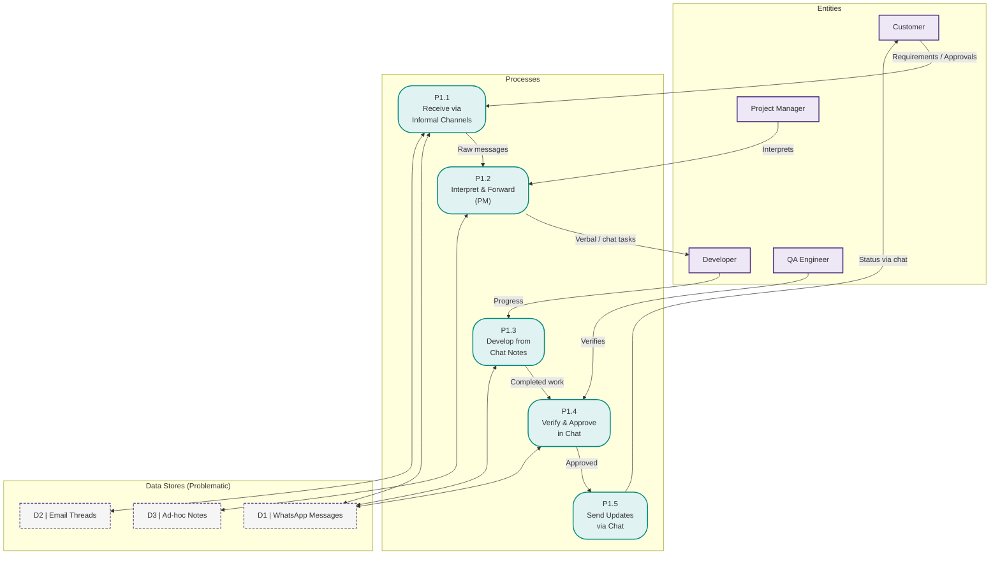
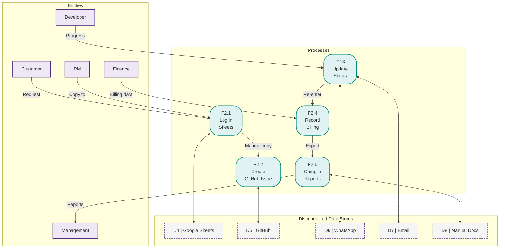
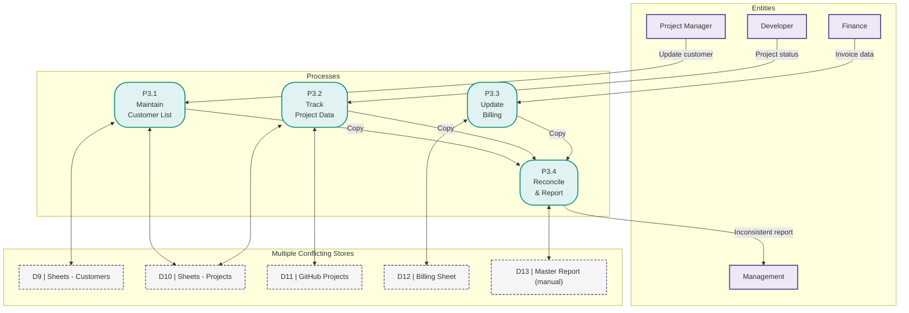
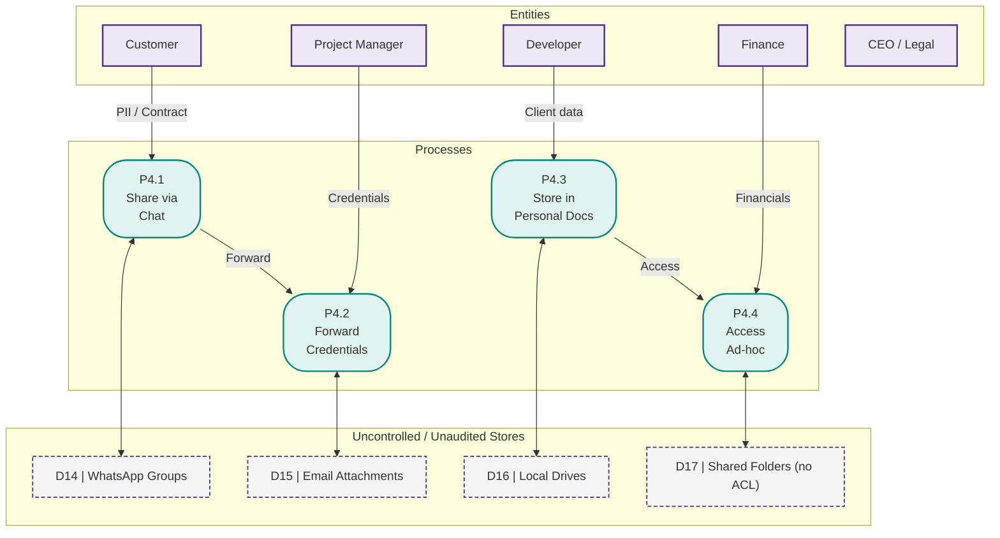
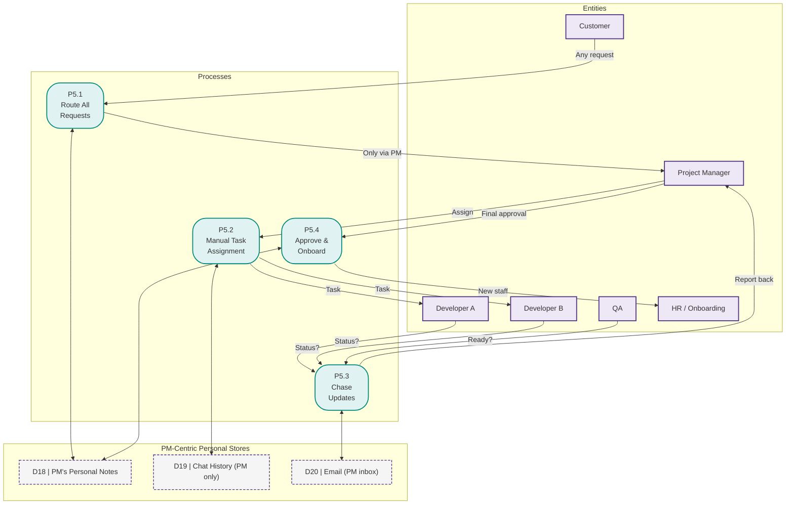

# DFD 1

```mermaid
flowchart TD
    subgraph Entities
        Cust[Customer]
        PM[Project Manager]
        Dev[Developer]
        QA[QA Engineer]
    end

    subgraph Processes
        P11["P1.1\nReceive via\nInformal Channels"]
        P12["P1.2\nInterpret & Forward\n(PM)"]
        P13["P1.3\nDevelop from\nChat Notes"]
        P14["P1.4\nVerify & Approve\nin Chat"]
        P15["P1.5\nSend Updates\nvia Chat"]
    end

    subgraph "Data Stores (Problematic)"
        D1["D1 | WhatsApp Messages"]
        D2["D2 | Email Threads"]
        D3["D3 | Ad-hoc Notes"]
    end

    %% Flows
    Cust -->|Requirements / Approvals| P11
    PM -->|Interprets| P12
    P11 -->|Raw messages| P12
    P12 -->|Verbal / chat tasks| Dev
    Dev -->|Progress| P13
    P13 -->|Completed work| P14
    QA -->|Verifies| P14
    P14 -->|Approved| P15
    P15 -->|Status via chat| Cust

    %% Bidirectional store connections (core problem)
    P11 <--> D1
    P11 <--> D2
    P12 <--> D3
    P13 <--> D1
    P14 <--> D1

    classDef entity fill:#EDE7F6,stroke:#4B2E83,stroke-width:2px
    classDef process fill:#E0F2F1,stroke:#00897B,stroke-width:2px,rx:30,ry:30
    classDef store fill:#F5F5F5,stroke:#4B2E83,stroke-width:1.5px,stroke-dasharray: 5 3

    class Cust,PM,Dev,QA entity
    class P11,P12,P13,P14,P15 process
    class D1,D2,D3 store
```

# DFD 2

```mermaid
flowchart TD
    subgraph Entities
        Cust[Customer]
        PM[PM]
        Dev[Developer]
        Fin[Finance]
        Mgt[Management]
    end

    subgraph Processes
        P21["P2.1\nLog in\nSheets"]
        P22["P2.2\nCreate\nGitHub Issue"]
        P23["P2.3\nUpdate\nStatus"]
        P24["P2.4\nRecord\nBilling"]
        P25["P2.5\nCompile\nReports"]
    end

    subgraph "Disconnected Data Stores"
        D4["D4 | Google Sheets"]
        D5["D5 | GitHub"]
        D6["D6 | WhatsApp"]
        D7["D7 | Email"]
        D8["D8 | Manual Docs"]
    end

    %% Manual flows
    Cust -->|Request| P21
    PM -->|Copy to| P21
    P21 -->|Manual copy| P22
    Dev -->|Progress| P23
    P23 -->|Re-enter| P24
    Fin -->|Billing data| P24
    P24 -->|Export| P25
    P25 -->|Reports| Mgt

    %% All stores isolated
    P21 <--> D4
    P22 <--> D5
    P23 <--> D6
    P23 <--> D7
    P25 <--> D8

    classDef entity fill:#EDE7F6,stroke:#4B2E83,stroke-width:2px
    classDef process fill:#E0F2F1,stroke:#00897B,stroke-width:2px,rx:30,ry:30
    classDef store fill:#F5F5F5,stroke:#4B2E83,stroke-width:1.5px,stroke-dasharray: 5 3

    class Cust,PM,Dev,Fin,Mgt entity
    class P21,P22,P23,P24,P25 process
    class D4,D5,D6,D7,D8 store

```

# DFD 3

```mermaid
flowchart TD
    subgraph Entities
        PM[Project Manager]
        Dev[Developer]
        Fin[Finance]
        Mgt[Management]
    end

    subgraph Processes
        P31["P3.1\nMaintain\nCustomer List"]
        P32["P3.2\nTrack\nProject Data"]
        P33["P3.3\nUpdate\nBilling"]
        P34["P3.4\nReconcile\n& Report"]
    end

    subgraph "Multiple Conflicting Stores"
        D9["D9 | Sheets - Customers"]
        D10["D10 | Sheets - Projects"]
        D11["D11 | GitHub Projects"]
        D12["D12 | Billing Sheet"]
        D13["D13 | Master Report (manual)"]
    end

    %% Duplication flows
    PM -->|Update customer| P31
    Dev -->|Project status| P32
    Fin -->|Invoice data| P33
    P31 -->|Copy| P34
    P32 -->|Copy| P34
    P33 -->|Copy| P34
    P34 -->|Inconsistent report| Mgt

    %% Independent writes
    P31 <--> D9
    P31 <--> D10
    P32 <--> D10
    P32 <--> D11
    P33 <--> D12
    P34 <--> D13

    classDef entity fill:#EDE7F6,stroke:#4B2E83,stroke-width:2px
    classDef process fill:#E0F2F1,stroke:#00897B,stroke-width:2px,rx:30,ry:30
    classDef store fill:#F5F5F5,stroke:#4B2E83,stroke-width:1.5px,stroke-dasharray: 5 3

    class PM,Dev,Fin,Mgt entity
    class P31,P32,P33,P34 process
    class D9,D10,D11,D12,D13 store
```

# DFD 4

```mermaid
flowchart TD
    subgraph Entities
        Cust[Customer]
        PM[Project Manager]
        Dev[Developer]
        Fin[Finance]
        CEO[CEO / Legal]
    end

    subgraph Processes
        P41["P4.1\nShare via\nChat"]
        P42["P4.2\nForward\nCredentials"]
        P43["P4.3\nStore in\nPersonal Docs"]
        P44["P4.4\nAccess\nAd-hoc"]
    end

    subgraph "Uncontrolled / Unaudited Stores"
        D14["D14 | WhatsApp Groups"]
        D15["D15 | Email Attachments"]
        D16["D16 | Local Drives"]
        D17["D17 | Shared Folders (no ACL)"]
    end

    %% Sensitive data flows
    Cust -->|PII / Contract| P41
    PM -->|Credentials| P42
    P41 -->|Forward| P42
    Dev -->|Client data| P43
    Fin -->|Financials| P44
    P43 -->|Access| P44

    %% No controls
    P41 <--> D14
    P42 <--> D15
    P43 <--> D16
    P44 <--> D17

    classDef entity fill:#EDE7F6,stroke:#4B2E83,stroke-width:2px
    classDef process fill:#E0F2F1,stroke:#00897B,stroke-width:2px,rx:30,ry:30
    classDef store fill:#F5F5F5,stroke:#4B2E83,stroke-width:1.5px,stroke-dasharray: 5 3

    class Cust,PM,Dev,Fin,CEO entity
    class P41,P42,P43,P44 process
    class D14,D15,D16,D17 store
```

# DFD 5

```mermaid
flowchart TD
    subgraph Entities
        Cust[Customer]
        PM[Project Manager]
        Dev1[Developer A]
        Dev2[Developer B]
        QA[QA]
        HR[HR / Onboarding]
    end

    subgraph Processes
        P51["P5.1\nRoute All\nRequests"]
        P52["P5.2\nManual Task\nAssignment"]
        P53["P5.3\nChase\nUpdates"]
        P54["P5.4\nApprove &\nOnboard"]
    end

    subgraph "PM-Centric Personal Stores"
        D18["D18 | PM's Personal Notes"]
        D19["D19 | Chat History (PM only)"]
        D20["D20 | Email (PM inbox)"]
    end

    %% Everything funnels through PM
    Cust -->|Any request| P51
    P51 -->|Only via PM| PM
    PM -->|Assign| P52
    P52 -->|Task| Dev1
    P52 -->|Task| Dev2
    Dev1 -->|Status?| P53
    Dev2 -->|Status?| P53
    QA -->|Ready?| P53
    P53 -->|Report back| PM
    PM -->|Final approval| P54
    P54 -->|New staff| HR

    %% PM's private stores
    P51 <--> D18
    P52 <--> D19
    P53 <--> D20
    P54 <--> D18

    classDef entity fill:#EDE7F6,stroke:#4B2E83,stroke-width:2px
    classDef process fill:#E0F2F1,stroke:#00897B,stroke-width:2px,rx:30,ry:30
    classDef store fill:#F5F5F5,stroke:#4B2E83,stroke-width:1.5px,stroke-dasharray: 5 3

    class Cust,PM,Dev1,Dev2,QA,HR entity
    class P51,P52,P53,P54 process
    class D18,D19,D20 store
```
