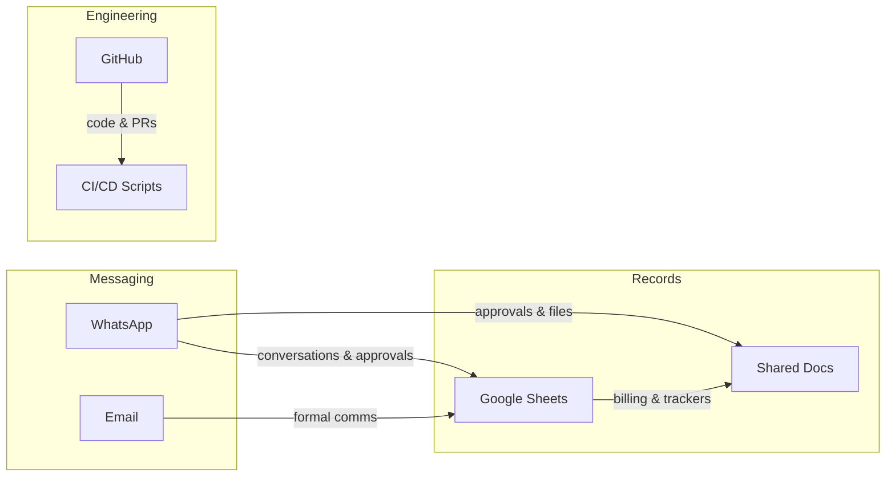

# Chapter 1 — Recognition of Need

## 1.1 Introduction
This chapter establishes the rationale for proposing an improved information system for Nextstepbd. It describes the organisational context, the company's principal activities, the tools and workflows currently in use, and the set of priority problems that motivate the study. The objective is to define the recognition of need clearly and to provide a basis for subsequent analysis and proposed solutions.

## 1.2 Company Overview
Nextstepbd is a Bangladesh-based technology firm specialising in bespoke software development, automation and IT consultancy. The organisation employs approximately fifty staff across development, design and project management roles and provides services to both domestic and international clients in sectors such as retail, healthcare, logistics and customer service.

Key organisational facts

- Location: Bangladesh (serving local and international clients)
- Approximate team size: 50 (developers, designers, project managers)
- Primary services: custom software systems, AI-enabled automation, consultancy, and social media support solutions
- Business model: project-based engagements with options for long-term maintenance contracts

As Nextstepbd has grown from a small delivery team into a multi-project organisation, a number of operational gaps have emerged that impede consistent, high-quality delivery and make scaling more difficult.

## 1.3 Business Activities and Service Context
Nextstepbd's operations can be summarised in repeating phases common to software service organisations:

1. Client engagement and scoping
2. Requirement elicitation and proposal drafting
3. Project planning and resource allocation
4. Development, testing and deployment
5. Post-deployment support and maintenance

The company operates in a delivery-centric context where accurate requirements capture, validated approvals, predictable delivery schedules, and reliable billing are essential for customer satisfaction and business viability.

## 1.4 Existing System and Tools Used
Currently, Nextstepbd relies on a heterogeneous mix of informal and formal tools to support business processes. These include messaging platforms (primarily WhatsApp), Google Sheets for lightweight records and trackers, GitHub for source control and issue tracking, email for formal correspondence, and local shared documents. Deployment is performed using project-specific scripts.

There is no single authoritative system acting as the company’s "system of record" for customers, projects, requirements and approvals; information exists in multiple places and often requires manual reconciliation.

### 1.4.1 Tools map
The diagram below summarises the principal tools and the dominant information flows between them.



## 1.5 Current Workflow
The following sequence describes a typical workflow for handling a client request in the present environment:

1. The client submits a request or approval via WhatsApp or email.
2. The project manager (PM) or account lead records the request informally in chat and sometimes copies the details into a Google Sheet for tracking.
3. The PM clarifies scope in chat and allocates work by creating tasks in GitHub or assigning developers directly.
4. Developers implement the change and create pull requests; notifications are sent through chat channels.
5. Quality assurance or the PM approves the change (often communicated via chat); deployment is executed with project-specific scripts.
6. Financial and status updates are recorded manually in Sheets for billing and reporting.

### 1.5.1 Current Workflow (diagram)

```mermaid
flowchart TD
  Client[Client message (WhatsApp/Email)] --> PM[Project Manager]
  PM -->|copy request| Sheets[Google Sheets]
  PM -->|assign work| Dev[Developer]
  Dev -->|push code| GH[GitHub]
  GH -->|pull request| PM
  PM -->|approve in chat| Dev
  Dev -->|deploy via scripts| Prod[Production]
  Sheets -->|status & billing updates| Finance[Finance / Reporting]
  Prod -->|release notes| Sheets
```

### Observations
- Decisions and approvals are frequently recorded only in informal chat channels and not attached to formal project artifacts.
- Multiple manual hand-offs and unstructured transfers of information increase the probability of errors and omissions.
- Financial and management reporting depend on manual reconciliation across disparate artefacts.

### 1.5.2 Process interpretation
The diagram shows that the present workflow is heavily dependent on the project manager as an intermediary between the client, the development team and the administrative record-keeping process. Information begins in chat or email, is then copied manually into Sheets, passed verbally or informally to developers, and finally reconciled again for finance and reporting. This arrangement provides flexibility, but it also introduces delays, duplication and a high risk of inconsistency because the same request is represented in several disconnected places.

## 1.6 Need for System Improvement
The current configuration of tools and processes generates several operational risks:

- Loss of authoritative approvals: informal confirmations in chat are not reliably recorded against tasks.
- Data inconsistency: the absence of a canonical data store leads to duplication and conflicting records.
- Manual process burden: project managers and administrators devote substantial time to reconciliation and coordination rather than value-adding work.
- Security and compliance exposure: sensitive data is sometimes shared through insecure channels without audit trails.
- Scalability limitations: reliance on manual processes and key individuals creates bottlenecks that constrain growth.

An appropriate improvement strategy must be pragmatic: it should preserve users' existing preferred communication channels while capturing and formalising the items that must be auditable and actionable.

## 1.7 Problem Identification
The study identifies five priority problems that will be addressed in the remainder of this report. Each problem is presented with a concise description, an illustrative example and the principal stakeholders affected.

### 1.7.1 Problem 1 — Fragmented Communication and Collaboration
- **Description:** Project decisions, approvals and important clarifications are routinely exchanged via informal messaging channels (e.g., WhatsApp) and are not consistently captured in structured project artefacts.
- **Illustrative example:** A client posts a one-line approval in a WhatsApp group; developers proceed without the PM adding the approval to the tracked requirement, later resulting in scope disagreement.
- **Impact:** Rework, client dissatisfaction and potential disputes.
- **Stakeholders:** Project management, development teams, QA, clients.

### 1.7.2 Problem 2 — System Fragmentation and Lack of Integration
- **Description:** Multiple independent tools are used without an integration strategy, requiring manual cross-referencing and reconciliation.
- **Illustrative example:** Customer and billing status are recorded in separate Google Sheets maintained by different teams, leading to inconsistent invoicing.
- **Impact:** Administrative overhead and impaired decision quality.
- **Stakeholders:** Operations, finance, management.

### 1.7.3 Problem 3 — Data Management and Governance Deficiencies
- **Description:** There is no single source of truth for core business entities; data duplication and unsystematic updates compromise reporting and analysis.
- **Illustrative example:** Conflicting invoice records for the same client appear in different trackers, producing accounting discrepancies.
- **Impact:** Financial risk and reduced managerial visibility.
- **Stakeholders:** Finance, executive management.

### 1.7.4 Problem 4 — Security and Access Control Risks
- **Description:** Sensitive information is exchanged through informal channels without consistent access controls or audit trails.
- **Illustrative example:** Credentials or personally identifiable information (PII) appear in chat transcripts with no record of access or retention.
- **Impact:** Risk of data breaches, regulatory non-compliance and reputational harm.
- **Stakeholders:** Clients, legal, IT/security.

### 1.7.5 Problem 5 — Scalability and Operational Bottlenecks
- **Description:** Manual task assignment and single-point decision-making create performance constraints and dependency on individual staff.
- **Illustrative example:** When the PM is unavailable, routine approvals and task routing stall, delaying development activities.
- **Impact:** Reduced throughput, increased lead times and staff burnout.
- **Stakeholders:** Human resources, team leads, project management.

## 1.8 Summary of Identified Needs
The analysis in this chapter suggests a set of core needs for the organisation:

1. Mechanisms to capture and record authoritative approvals and decisions from informal channels.
2. A canonical data store for customers, projects and requirements to reduce duplication and enable reliable reporting.
3. Integration between collaboration tools and the canonical store to maintain familiar user interfaces while ensuring data integrity.
4. Basic governance controls (RBAC, audit logs, PII handling) to reduce exposure.
5. Automation of routine workflow tasks to reduce manual coordination and improve scalability.

## 1.9 Conclusion
This chapter has established the organisational context and a set of well-defined problems that motivate the proposed system interventions. The subsequent chapters will analyse requirements, evaluate feasibility, and propose concrete, phased solutions designed to be both practical and technically feasible within the organisation's operational constraints.
