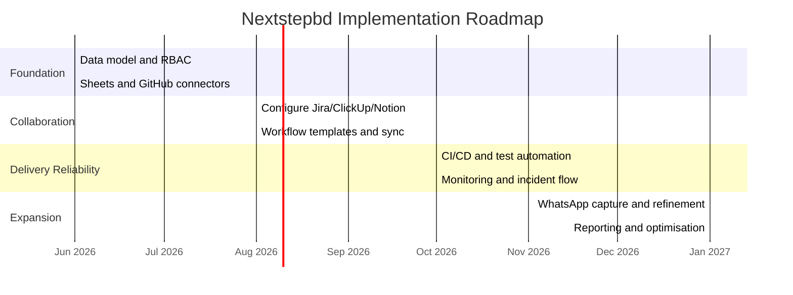

# Chapter 2 — Initial Feasibility Study

## 2.1 Introduction
This chapter performs an initial feasibility study for the proposed improvement initiative at Nextstepbd. The purpose of the study is to assess whether the recommended solution approach is technically possible, financially reasonable, operationally acceptable and realistic to implement within the organisation's time and resource constraints.

The proposed direction is not to replace the company's existing communication habits, but to support them with a structured and integrated information environment. Accordingly, the analysis considers five identified problems and evaluates how each would be addressed by the three proposed systems: a Central Integration & Data Platform, a Collaboration & Workflow system built on existing software, and a DevOps, QA & Observability platform.

## 2.2 Initial Feasibility Analysis

### 2.2.1 Problem 01 — Fragmented Communication and Collaboration

**Problem statement**
Important decisions, approvals and clarifications are frequently communicated through informal channels such as WhatsApp and email. These exchanges are not consistently captured in a formal project record, which leads to misunderstandings, repeated clarification cycles and scope disputes.

**Technical feasibility**
This problem is highly feasible to address because the company can keep using the communication tools it already uses while adding a capture layer to record important decisions. A central platform can receive message metadata, manual confirmations or webhook-triggered events and convert them into structured records. Since the initial solution does not require replacing WhatsApp or email, the technical effort is moderate and can be implemented incrementally.

**Economic feasibility**
The economic cost is reasonable because the organisation can begin with a small pilot and use a limited number of integrations. The company will not need to build a complete messaging platform from scratch. Instead, it can invest in lightweight automation, integration services and a collaboration tool subscription or configuration. The expected return comes from fewer missed approvals, less rework and fewer delays.

**Operational feasibility**
The proposed solution aligns well with current user behaviour because staff and clients can continue using familiar communication channels. Important items are simply captured into a formal system. This makes the solution operationally feasible and acceptable to users, provided that the capture process is simple and does not add unnecessary friction.

**Schedule feasibility**
This problem can be addressed early in the project because it depends mostly on workflow design, integration, and configuration of existing tools. A basic pilot can be delivered within a short timeframe, especially if the organisation starts with a small number of project teams.

**Feasibility summary**
This problem is highly feasible to address because it can be improved without replacing the company's existing communication channels. The technical effort is moderate, the cost is manageable, and the operational impact is positive because users keep working in familiar tools while approvals are captured more reliably.

### 2.2.2 Problem 02 — System Fragmentation and Lack of Integration

**Problem statement**
The company currently uses several disconnected tools such as Google Sheets, GitHub, email and chat applications. Because these systems are not integrated, data must be copied manually and frequently becomes inconsistent.

**Technical feasibility**
This problem is technically feasible to solve using a central data layer, APIs and connectors. Existing tools provide standard APIs and webhooks, which makes integration practical. A canonical database can act as the source of truth while other tools exchange data through controlled interfaces.

**Economic feasibility**
The cost of integration is moderate. It is cheaper to connect existing tools than to replace them. The main investment is in integration development, data mapping and maintenance. The long-term benefit is reduced duplication and lower administrative overhead.

**Operational feasibility**
A central integration approach is operationally appropriate because it reduces the need for staff to cross-check multiple records manually. However, it must be introduced carefully to avoid disrupting existing work habits. The integration should therefore be gradual and focused on high-value processes first.

**Schedule feasibility**
The problem can be solved in phases. The first phase can connect a small number of sources, such as Sheets and GitHub, before more complex sources are added. This phased approach is schedule-feasible and reduces implementation risk.

**Feasibility summary**
This problem is highly feasible because it can be solved incrementally through standard integrations. The cost is reasonable, the implementation can be phased, and the operational benefit is strong because staff will no longer need to manually reconcile disconnected tools.

### 2.2.3 Problem 03 — Data Management and Governance Deficiencies

**Problem statement**
No single authoritative data repository exists for customers, projects and requirements. As a result, duplicate records and conflicting updates occur, which weakens reporting and managerial control.

**Technical feasibility**
A central database with carefully designed entities, validation rules and audit logging is technically straightforward for a software company to implement. Modern relational databases and integration frameworks are mature and reliable.

**Economic feasibility**
The cost is justified because poor data management directly affects billing accuracy, reporting and decision-making. Improving data quality reduces hidden costs such as manual reconciliation and rework. Although there is some upfront design and migration effort, the long-term savings are substantial.

**Operational feasibility**
This improvement is operationally feasible because it gives management a clearer view of business information. The main challenge is ensuring that users trust the central system and use it consistently. This can be addressed by making the system the preferred source for reporting and task linkage.

**Schedule feasibility**
This problem should be addressed early, but it does not need to be solved all at once. Core data entities can be introduced first, and existing records can be migrated gradually. This makes the schedule manageable.

**Feasibility summary**
This problem is feasible and strategically important. A central database and governance model are technically straightforward, economically justified, and operationally valuable because they improve reporting accuracy and reduce duplication.

### 2.2.4 Problem 04 — Security and Access Control Risks

**Problem statement**
Sensitive information is sometimes shared through informal channels and there is no consistent access control or audit trail for data changes. This creates risk for the organisation and its clients.

**Technical feasibility**
The problem is feasible to address through role-based access control, central authentication, audit logging and improved handling of sensitive fields. These are standard features in modern systems and can be built using existing identity management tools and secure storage practices.

**Economic feasibility**
The financial justification is strong because security incidents, data leaks and compliance failures can be costly. Implementing security controls is cheaper than dealing with the consequences of a breach. Much of the required capability can also be provided by open-source or managed services.

**Operational feasibility**
Security controls are operationally feasible, but they must be introduced in a way that does not obstruct daily work. Access rules should match actual roles, and approval workflows should remain simple. If controls are too strict or difficult to use, staff may try to bypass them.

**Schedule feasibility**
Basic security controls can be introduced alongside the early platform work. Authentication, role mapping and audit logging should be part of the first release rather than postponed, because security is a foundational requirement.

**Feasibility summary**
This problem is feasible and should be treated as a baseline requirement. The technical controls are standard and available, the cost is justified by risk reduction, and the operational fit is strong if the controls are designed to be lightweight and role-aware.

### 2.2.5 Problem 05 — Scalability and Operational Bottlenecks

**Problem statement**
Manual processes, single-person dependencies and a lack of standardised workflow create bottlenecks as the team grows. The company becomes increasingly dependent on a few key individuals.

**Technical feasibility**
This problem is technically feasible to solve through workflow automation, task templates, role-based assignment and monitoring. These are not highly experimental capabilities; they are common in process-oriented software environments.

**Economic feasibility**
The problem has strong economic justification because it directly affects productivity, speed of delivery and staff utilisation. Reducing bottlenecks improves throughput and helps the company handle more projects without a proportional increase in overhead.

**Operational feasibility**
The solution is operationally feasible if the company accepts more structured work assignment and task visibility. Existing staff can keep their familiar collaboration tools, while the structured system ensures that no work item depends on memory or personal follow-up alone.

**Schedule feasibility**
Scalability improvements should be introduced in parallel with workflow and integration improvements. They can begin with templates, notifications and assignment rules, then expand into richer automation as the organisation matures.

**Feasibility summary**
This problem is highly feasible because workflow automation and role-based assignment are common features in modern systems. The cost is moderate, the benefits are significant, and the changes fit the organisation's need to reduce dependence on a few key individuals.

## 2.3 Comparative Feasibility Summary
The table below summarises the relative feasibility of each problem area.

| Problem | Technical Feasibility | Economic Feasibility | Operational Feasibility | Schedule Feasibility | Overall Assessment |
|---|---|---|---|---|---|
| Fragmented Communication & Collaboration | High | High | High | High | Very feasible |
| System Fragmentation & Lack of Integration | High | High | Medium-High | Medium-High | Very feasible |
| Data Management & Governance Deficiencies | High | High | Medium-High | Medium | Feasible with phased migration |
| Security & Access Control Risks | High | High | Medium | High | Necessary and feasible |
| Scalability & Operational Bottlenecks | High | High | High | Medium-High | Highly feasible |

Interpretation
- All five problems are feasible to address, but they should not be approached as separate, unrelated projects.
- A shared foundation is required, namely the Central Integration & Data Platform.
- The Collaboration & Workflow system and DevOps platform build on that foundation and address user adoption and operational reliability respectively.
- Security and access control must be implemented across all systems rather than treated as an optional add-on.

## 2.4 Recommended Implementation Roadmap
The recommended implementation strategy is phased so that the organisation can gain value early while reducing risk.

### Phase 1 — Foundation and core data model
- Establish the canonical data model for customers, projects, requirements and tasks.
- Implement authentication, role-based access control and audit logging.
- Build the first connectors for Google Sheets and GitHub.
- Start capturing formal records from informal requests.

### Phase 2 — Collaboration and workflow alignment
- Configure the existing collaboration tool (e.g., Jira, ClickUp or Notion) as the team’s structured work environment.
- Integrate task creation and status updates with the central platform.
- Introduce templates for requirements, tasks, approvals and onboarding.
- Pilot the workflow with a small project team.

### Phase 3 — Delivery automation and reliability
- Introduce CI/CD pipelines, test automation and staging deployment.
- Add monitoring, logging, alerting and incident workflows.
- Connect incidents and deployment metadata back to the central system.

### Phase 4 — Expansion and optimisation
- Add the WhatsApp capture workflow and other remaining integrations.
- Improve reconciliation, reporting and governance.
- Refine automation based on pilot feedback and measured usage.

### 2.4.1 Roadmap diagram

## 2.5 Conclusion
The initial feasibility study shows that the proposed solution is realistic, implementable and economically justified. None of the five identified problems requires a fully custom end-to-end platform to be built at once. Instead, the recommended approach is to combine a central integration layer, a configured collaboration tool, and a DevOps/observability platform in a phased implementation. This approach balances technical feasibility, user acceptance and organisational capacity while addressing the core operational weaknesses identified in Chapter 1.
