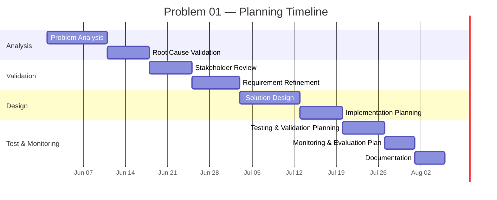
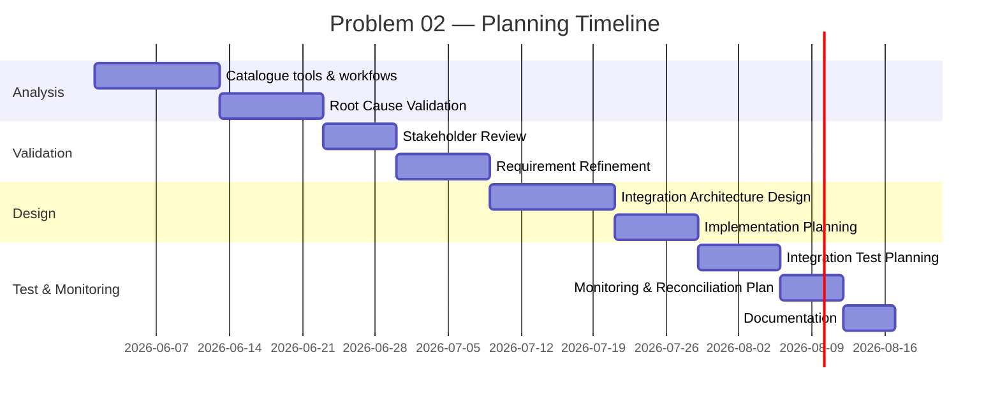
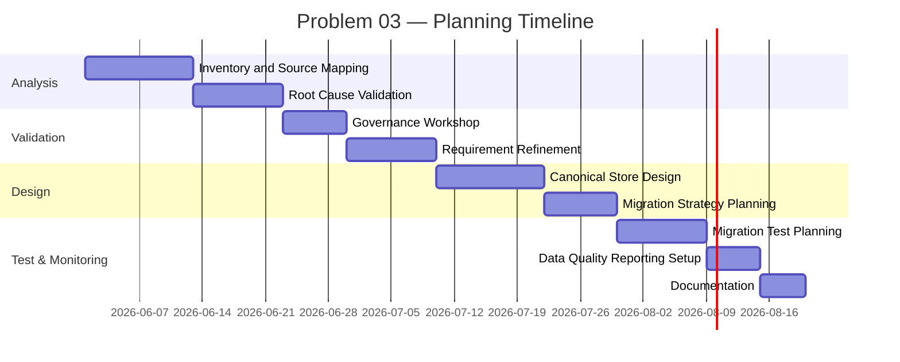
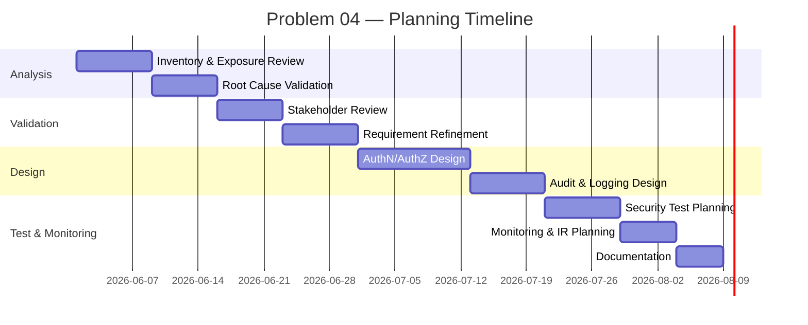
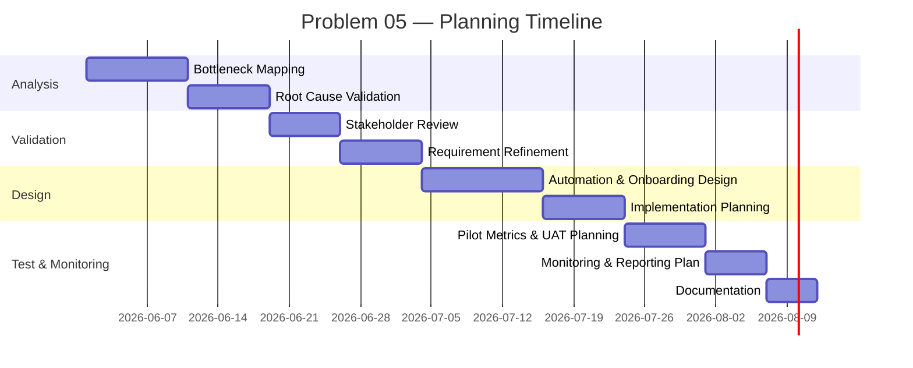

# Chapter 3 — Project Planning

## 3.1 Introduction
This chapter presents the project plan for Nextstepbd's improvement initiative. It sets out the scope, schedule, stakeholder engagement approach, cost considerations and quality arrangements that will guide design and pilot activities. The chapter draws on the problem statements and feasibility analysis in Chapters 1 and 2 and translates those findings into a practical plan for review and approval.

The chapter uses standard project-planning terms. It covers scope refinement, schedule development, stakeholder engagement, cost considerations and quality planning. Because the organisation will keep its current communication channels, the plan focuses on integrating informal inputs safely and with minimal disruption. The emphasis is on preparation: analysis, stakeholder validation, pilot design and monitoring setup.

## 3.2 Planning in Nextstepbd
Project governance for this initiative will be established as a lightweight, accountable structure appropriate for a small-to-medium software services company. The governance model comprises: an executive sponsor (senior company partner), a project manager (internal PM PO/PM), a small steering committee (executive sponsor, head of delivery, head of operations, finance representative), and a cross-functional project team (backend developer, integration specialist, QA/DevOps engineer, business analyst). External consultants may be engaged for specialised integration tasks as required.

Scope definition will be constrained to planning and pilot preparation activities during the initial project phase; the intention is to deliver planning artefacts, validated designs and pilots that demonstrate the expected operational improvements before full organisational rollout. Baseline planning deliverables include: Work Breakdown Structures (WBS) for each identified problem area, detailed schedule (Gantt), stakeholder engagement records and a draft cost and quality management plan. Risk management and procurement strategies will be described in follow-up documentation but are considered in schedule and stakeholder planning herein.

## 3.3 Planning to Resolve the Problems
This section presents planning activities tailored to each of the priority problems identified in Chapter 1. For each problem the chapter provides: a Work Breakdown Structure (WBS); a Gantt chart derived from the WBS focusing on analysis and planning activities; a synthetic record of stakeholder validation and feedback; high-level cost management considerations; and a problem-specific quality management plan. The WBS and Gantt charts are deliberately planning-focused and do not assume implementation progress beyond preparation, pilot configuration and validation.

### 3.3.1 Problem 01 — Fragmented Communication & Collaboration

Problem context
Nextstepbd depends heavily on chat-based communication for approvals, clarification, and day-to-day coordination. In practice, important decisions can remain buried in long message threads, which makes it difficult to trace what was agreed, who approved it, and which work item it relates to. This creates delays, repeated clarification, and weak evidence for delivery decisions.

#### 3.3.1.1 Schedule Management
Work Breakdown Structure (WBS)
1. Fragmented Communication — Planning
  1.1 Problem Analysis
    1.1.1 Review chat message patterns and sample threads
    1.1.2 Identify decision/approval artefacts and their distribution
  1.2 Root Cause Validation
    1.2.1 Verify communication dependency on PMs
    1.2.2 Map failed handoffs and typical consequences
  1.3 Stakeholder Review
    1.3.1 Facilitate stakeholder validation workshop (PMs, developers, account managers)
    1.3.2 Document stakeholder inputs and acceptance criteria
  1.4 Requirement Refinement
    1.4.1 Define capture requirements (what constitutes an "official" approval)
    1.4.2 Specify operator review UI requirements
  1.5 Solution Design
    1.5.1 Design capture flow and API contract to central platform
    1.5.2 Define UX for one-click confirmation
  1.6 Implementation Planning (preparation)
    1.6.1 Define pilot scope and success metrics
    1.6.2 Identify pilot teams and access requirements
  1.7 Testing & Validation Planning
    1.7.1 Define test cases for capture accuracy and latency
    1.7.2 Plan pilot acceptance tests and measurement method
  1.8 Monitoring & Evaluation Planning
    1.8.1 Define monitoring KPIs (capture rate, error rate)
    1.8.2 Establish dashboard and reporting cadence
  1.9 Documentation
    1.9.1 Prepare user guides and operator runbook
    1.9.2 Prepare stakeholder sign-off package

Gantt chart (planning-focused)

#### 3.3.1.2 Stakeholder Engagement
Following the problem presentation, a stakeholder validation workshop was facilitated with project managers, senior developers, and account leads. The workshop minutes recorded the following specific feedback and clarifications.

Stakeholder validation summary
Project managers emphasised that approvals in chat are frequently informal and often lack context (for example: missing scope boundaries or acceptance criteria). Developers reported that chat-only approvals lead to divergent interpretations of requirements, especially for multi-iteration features. Account leads observed that client confirmations are sometimes fragmented across multiple messages which complicates billing evidence.

Concerns raised
Stakeholders were concerned about the administrative burden introduced by any capture mechanism that required extensive manual entry; they emphasised the need for a low-friction, one-click confirmation flow. Additionally, several team members flagged possible privacy concerns where client messages included PII; these required controlled redaction and access restrictions. Another concern was workload: PMs highlighted that they are already time-constrained and requested automation to reduce manual reconciliation tasks rather than shift additional tasks onto PMs.

Refinements to problem definition
Based on stakeholder feedback, the project team refined the problem statement to focus on capturing contextual approvals (approval + scope fragment + timestamp + actor) rather than raw chat transcripts. The requirement set now includes a mandatory minimal metadata model (approval flag, reference to requirement, approver identity) and an operator review queue for ambiguous items.

Constraints and risks identified
Stakeholders identified WhatsApp API limitations (templates and rate limits) and occasional offline access constraints for some clients. Risk of user resistance to any additional steps was recorded and mitigations were requested (e.g., short training sessions and in-app prompts).

Incorporation of feedback in planning
The planning team will include a lightweight human-in-loop operator flow, enforce strict PII redaction policies, and prioritise automation of the capture workflow to minimise PM workload. The pilot scope will include two project teams with representative client types (local and international) to validate the approach.

#### 3.3.1.3 Cost Management
A high-level cost management approach for this problem focuses on resource identification and control rather than detailed budgeting at this stage. Expected resources include: one backend integration engineer (part-time), one frontend/UI resource for the operator confirmation UI (part time), one QA/tester (part-time), and 20% allocation of a PM for stakeholder coordination. Contract costs for a WhatsApp gateway (Twilio or managed provider) are anticipated if the managed API path is selected.

  Budget considerations include initial integration development and a small SaaS subscription for pilot monitoring dashboards if required. Cost monitoring will use standard cost performance indicators at planning stage (planned value for planning tasks) and a simple time-and-materials tracking for initial sprints. Cost control strategies include using open-source integration tools where possible, limiting pilot scope to two projects, and deferring expensive connectors until validated.

#### 3.3.1.4 Quality Management
Quality objectives for addressing fragmented communication are: (1) capture 95% of formal approvals that relate to tracked requirements during the pilot; (2) reduce clarification cycles related to approvals by 50% in pilot projects; (3) ensure no unredacted PII is stored in the canonical database.

Acceptance criteria
The pilot will be accepted if the operator queue demonstrates a capture accuracy above 95% on a test sample and stakeholders confirm that captured approvals can be unambiguously linked to work items in the collaboration tool. Security acceptance requires demonstration of redaction and controlled access.

Measurement and validation
Quality will be measured through sampling and automated metrics: capture_rate = (number of approvals captured to canonical records) / (number of approvals identified in sample chat threads), review_resolution_time, and number of PII exposures. Validation will use pilot acceptance tests and user feedback sessions.

Monitoring and control mechanisms
Daily ingestion metrics and a weekly quality review will be established. Quality risks include false positives/negatives in automated extraction, and operator backlog growth. Mitigations include conservative confidence thresholds for automated acceptance, a capped operator queue size and escalation rules for unresolved items.

Quality assurance and control activities
Quality assurance activities include review of parser rules, test suites for message extraction, and controlled test data. Quality control activities include run-time sampling, audit logs review, and corrective tasking for rule adjustments.

### 3.3.2 Problem 02 — System Fragmentation & Lack of Integration

Problem context
Nextstepbd currently uses multiple tools and data stores that do not communicate consistently with one another. Information often has to be copied manually from one platform to another, which increases the chance of errors, duplicate records, and missed updates. The lack of integration also makes it harder for staff to get a single, reliable view of operational information.

#### 3.3.2.1 Schedule Management
Work Breakdown Structure (WBS)
1. System Fragmentation — Planning
  1.1 Problem Analysis
    1.1.1 Catalogue existing data stores and tools
    1.1.2 Map high-frequency cross-system workflows
  1.2 Root Cause Validation
    1.2.1 Identify barriers to integration (APIs, rate limits, workflows)
    1.2.2 Prioritise integration targets based on business value
  1.3 Stakeholder Review
    1.3.1 Conduct workshops with operations and finance
    1.3.2 Validate integration priorities and constraints
  1.4 Requirement Refinement
    1.4.1 Define canonical data model requirements
    1.4.2 Define connector contracts and event models
  1.5 Solution Design
    1.5.1 Design integration architecture and API contracts
    1.5.2 Define retry, queuing and error handling strategies
  1.6 Implementation Planning
    1.6.1 Pilot connector selection and scheduling
    1.6.2 Provisioning of queue and integration infra
  1.7 Testing & Validation Planning
    1.7.1 Integration test plan and environment design
    1.7.2 Reconciliation test cases and acceptance criteria
  1.8 Monitoring & Evaluation Planning
    1.8.1 Define integration health KPIs
    1.8.2 Define reconciliation reporting cadence
  1.9 Documentation
    1.9.1 API contract documentation
    1.9.2 Integration runbooks and operator procedures

Gantt chart (planning-focused)

#### 3.3.2.2 Stakeholder Engagement
Stakeholders engaged for this topic included operations leads, finance representatives, and senior engineers. The stakeholder workshop produced the following substantive inputs.

Validation and feedback
Operations emphasised the prevalence of ad-hoc, manual reconciliation tasks consuming several person-days each month. Finance described specific reconciliation errors that had previously led to misinvoicing. Engineers identified several integration constraints, including lack of stable external IDs in some Sheets, inconsistent schema versions, and API rate limits for certain provider integrations. All parties prioritized connectors that directly reduce reconciliation labour (Sheets to canonical customer mapping and GitHub issue status to project trackers).

Concerns raised
Engineering stakeholders warned about the time required to implement robust deduplication and mapping logic, particularly for legacy Sheets with inconsistent headings. Finance requested that the canonical model preserve provenance for all data to enable auditability. Operations requested that integrations be resilient and observable to avoid silent failures.

Refinements to problem definition
The problem definition was refined to focus on high-value integration points and to emphasise the requirement for provenance metadata. The WBS was adjusted to include reconciliation test cases and provenance preservation requirements.

Constraints and risks identified
Constraints include existing unstructured spreadsheets, potential need for data cleansing, and API rate limits for some SaaS endpoints. Risks include the potential for partial sync states and reconciliations that create temporary inconsistencies.

Incorporation into planning
The project team will prioritise connectors that reduce manual reconciliation first, allocate a data-cleaning sprint in the pilot, and include comprehensive reconciliation reports in acceptance criteria.

#### 3.3.2.3 Cost Management
Resource expectations focus on a small integration team: one integration engineer full-time for the pilot period, one data analyst (part-time) for mapping and cleaning, and one QA resource for integration testing. Infrastructure costs include queueing/messaging and modest compute resources; if a managed iPaaS is chosen, subscription fees must be budgeted.

Cost monitoring will track planned versus actual effort across integration tasks and will monitor vendor subscription costs. Cost control strategies include staging connectors (start with Sheets and GitHub), using open-source middleware where appropriate, and deferring expensive enterprise connectors until the central model is proven.

A reminder is included that comprehensive economic analysis will be completed in a subsequent chapter as part of project controls.

#### 3.3.2.4 Quality Management
Quality objectives: (1) successful, auditable synchronization for core data fields for 95% of sample records; (2) reconciliation reports generated automatically and checked weekly; (3) maintenance of provenance for all synchronized records.

Acceptance criteria: the integration pilot must demonstrate end-to-end synchronization for the selected connectors with clear reconciliation outputs and error-handling behavior.

Measurement and validation: quality will be measured by data synchronization success rate, reconciliation discrepancy counts, and mean time to detect synchronization failures.

Monitoring and control: scheduled reconciliation jobs and dashboards will surface anomalies; alerting will notify operators when error thresholds are exceeded.

Quality assurance: include contract tests, mock endpoint tests, and sample-based reconciliation validation. Quality control: continuous monitoring and periodic manual spot checks.

### 3.3.3 Problem 03 — Data Management & Governance Deficiencies

Problem context
Several working records appear to be maintained in spreadsheets and informal files without a consistent data structure or ownership model. This makes it difficult to keep records accurate, track their origin, or decide which version should be treated as the current one. As the company grows, these weaknesses can affect reporting quality, billing accuracy, and general operational control.

#### 3.3.3.1 Schedule Management
Work Breakdown Structure (WBS)
1. Data Management & Governance — Planning
  1.1 Problem Analysis
    1.1.1 Inventory data sources and owners
    1.1.2 Identify primary inconsistencies and duplication patterns
  1.2 Root Cause Validation
    1.2.1 Trace lineage for representative records
    1.2.2 Validate ownership and custodianship responsibilities
  1.3 Stakeholder Review
    1.3.1 Hold governance workshop (finance, operations, delivery)
    1.3.2 Agree on minimal canonical data model and retention rules
  1.4 Requirement Refinement
    1.4.1 Define schema and mandatory fields
    1.4.2 Define provenance and retention policy requirements
  1.5 Solution Design
    1.5.1 Design canonical store and data lifecycle
    1.5.2 Specify migration and reconciliation strategy
  1.6 Implementation Planning
    1.6.1 Plan migration sprints and validation checks
    1.6.2 Define roles for data stewardship
  1.7 Testing & Validation Planning
    1.7.1 Define migration validation tests and acceptance criteria
    1.7.2 Plan governance audits and sampling
  1.8 Monitoring & Evaluation Planning
    1.8.1 Establish data quality KPIs (completeness, consistency)
    1.8.2 Schedule periodic data quality reports
  1.9 Documentation
    1.9.1 Data dictionary and stewardship guide
    1.9.2 Retention and redaction policies

Gantt chart (planning-focused)

#### 3.3.3.2 Stakeholder Engagement
Governance workshops involved finance, delivery leads and an operations representative. Stakeholders provided concrete feedback during validation sessions.

Validation and feedback
Finance insisted on immutable provenance records and explicit retention policies for billing-related fields. Delivery leads highlighted that imposing strict mandatory fields prematurely would block engineering work; they recommended a phased approach where a minimal viable schema is enforced initially and additional fields are gradually required. Operations asked for clear data stewardship responsibilities and a lightweight process for resolving data conflicts.

Concerns raised
Stakeholders were concerned about the cost and time required for large-scale data cleansing, and expressed caution about any governance policy that could slow legitimate work. Another concern was the potential disruption to reporting if canonicalization changed identifiers used by external finance systems.

Refinements to problem definition
The problem definition was adjusted to prioritise creation of a minimal viable canonical schema and to introduce a staged governance model (pilot —> extend) to reduce initial disruption.

Constraints and risks identified
Large legacy Sheets with inconsistent keys and non-standardised columns were identified as a principal constraint. Risks include migration errors that could affect billing and limited staff availability for data-cleaning tasks.

Incorporation into planning
The project team will allocate a data-cleaning sprint and provision a part-time data analyst. The migration plan will include carefully designed rollback and reconciliation checkpoints.

#### 3.3.3.3 Cost Management
Resource needs include a data analyst (part-time), integration engineer support for migration tooling, and a portion of the PM's time. Infrastructure may require temporary compute/storage for staging and reconciliation tasks. Cost monitoring will use time-tracking and milestone-based controls; cost control strategies include prioritising high-impact data fields, automating cleaning where feasible, and deferring low-value data normalization.

Detailed financial evaluation will be deferred to a later chapter as noted in the project governance.

#### 3.3.3.4 Quality Management
Quality objectives: (1) canonical schema completeness of mandatory fields for 90% of migrated records in pilot; (2) reconciliation discrepancy rate below defined threshold; (3) documented data lineage for billing-critical records.

Acceptance criteria: pilot migration passes reconciliation tests, and stakeholders confirm the canonical representation supports required reporting.

Measurement and validation: data completeness, duplication rates, and reconciliation discrepancy counts will be measured. Validation will include sampling and automated checks.

Monitoring and control: weekly data quality reports and escalation for unresolved discrepancies. Quality risks include irreversible data loss and mismatches with legacy identifiers; mitigations include snapshot backups and staged migration.

Quality assurance and control: implement migration dry-runs, contract tests for data transforms, and pre-defined reconciliation scripts.

### 3.3.4 Problem 04 — Security & Access Control Risks

Problem context
Some operational information appears to move across tools with limited access control and limited audit visibility. This can lead to inconsistent handling of sensitive data, unclear responsibility for access decisions, and greater exposure if an account is shared or compromised. A more controlled approach is needed so that sensitive records can be handled with clearer rules and better traceability.

#### 3.3.4.1 Schedule Management
Work Breakdown Structure (WBS)
1. Security & Access Control — Planning
  1.1 Problem Analysis
    1.1.1 Inventory channels and typical PII exposures
    1.1.2 Review current access control practices and gaps
  1.2 Root Cause Validation
    1.2.1 Identify processes that allow credential sharing
    1.2.2 Map regulatory/compliance obligations
  1.3 Stakeholder Review
    1.3.1 Consult legal, operations and client-facing roles
    1.3.2 Validate risk appetite and policy priorities
  1.4 Requirement Refinement
    1.4.1 Define RBAC model requirements and SSO needs
    1.4.2 Define PII handling and redaction rules
  1.5 Solution Design
    1.5.1 Design authentication and authorization architecture
    1.5.2 Define audit logging and retention specifications
  1.6 Implementation Planning
    1.6.1 Plan SSO/RBAC integration and secret management
    1.6.2 Prepare test plan for access control
  1.7 Testing & Validation Planning
    1.7.1 Define security acceptance tests and penetration checks
    1.7.2 Define audit review schedules
  1.8 Monitoring & Evaluation Planning
    1.8.1 Define audit log monitoring KPIs
    1.8.2 Define incident detection and response plan
  1.9 Documentation
    1.9.1 Security policy and role matrix
    1.9.2 Incident response and redaction guides

Gantt chart (planning-focused)

#### 3.3.4.2 Stakeholder Engagement
Security planning workshops were held with legal counsel (internal or external), operations, and client-facing leads. The feedback from these sessions is recorded below.

Validation and feedback
Legal counsel recommended conservative retention and explicit conditions for unredaction, noting potential client contractual obligations. Operations requested pragmatic retention intervals and fast, auditable redaction procedures to meet client requests. Delivery leads noted the need to avoid overrestrictive access that would interfere with urgent support activities.

Concerns raised
Stakeholders were concerned about the complexity of retrofitting SSO and RBAC into disparate legacy tools (for example, Google Sheets and WhatsApp). They emphasised the need for a phased approach and documented exceptions. Another concern was the potential increase in support tickets resulting from new access controls.

Refinements to problem definition
The team refined the scope to prioritise audit logging, SSO for internal systems and production secrets management as first-order items; full SSO for external client communications was deferred pending provider support.

Constraints and risks identified
Constraints include limitations of third-party messaging platforms for access control and the need to manage exceptions where SSO is not possible. Risks include initial productivity loss due to access configuration changes and possible client friction for new processes.

Incorporation into planning
The plan integrates lightweight SSO for internal systems and vault-based secrets management; redaction workflows and audit reviews are built into acceptance criteria for the pilot.

#### 3.3.4.3 Cost Management
Resource expectations include security architect advisory time (part-time), identity provider subscription (if a managed SSO is used), and engineering time to integrate SSO and secrets management. Cost monitoring will capture license and integration effort, and control will be exercised by phasing upgrades and evaluating trade-offs between managed and self-hosted solutions.

A detailed economic evaluation for security investment will be performed later as part of overall project controls.

#### 3.3.4.4 Quality Management
Quality objectives: (1) implement audit logging for critical operations with 100% coverage of canonical record changes in pilot; (2) demonstrate controlled redaction/unredaction process; (3) implement RBAC for internal systems with role definitions and logging.

Acceptance criteria: audit logs available for review and role-based policies validated through test cases; redaction and unredaction require appropriate approvals and are recorded.

Measurement and validation: audit completeness, number of redaction incidents, and role assignment accuracy will be measured. Security testing will include basic penetration checks and role misconfiguration tests.

Monitoring and control: continuous monitoring of audit logs and scheduled audits. Quality assurance will involve security test plans and control checks; quality control will validate log integrity and role enforcement during pilot exercises.

### 3.3.5 Problem 05 — Scalability & Operational Bottlenecks

Problem context
As the company takes on more projects, a number of routine tasks still depend on a few key individuals and manual follow-up. This can slow onboarding, make task assignment inconsistent, and create bottlenecks when staff are unavailable. Without better process support, these issues can limit the organisation's ability to grow smoothly.

#### 3.3.5.1 Schedule Management
Work Breakdown Structure (WBS)
1. Scalability & Operational Bottlenecks — Planning
  1.1 Problem Analysis
    1.1.1 Map recurring bottlenecks and single-person dependencies
    1.1.2 Measure onboarding time and common failure modes
  1.2 Root Cause Validation
    1.2.1 Trace process steps that require manual PM intervention
    1.2.2 Validate capacity constraints and staff time allocation
  1.3 Stakeholder Review
    1.3.1 Workshop with HR, PMs and team leads
    1.3.2 Validate training and capacity planning needs
  1.4 Requirement Refinement
    1.4.1 Define templates and automation requirements
    1.4.2 Define onboarding checklist and competency criteria
  1.5 Solution Design
    1.5.1 Design automation flows (auto-assignment, escalation)
    1.5.2 Design onboarding materials and micro-training modules
  1.6 Implementation Planning
    1.6.1 Prepare pilot automation rules and metrics
    1.6.2 Define training schedule and mentors
  1.7 Testing & Validation Planning
    1.7.1 Define pilot evaluation metrics (throughput, cycle time)
    1.7.2 Plan user acceptance tests and training feedback sessions
  1.8 Monitoring & Evaluation Planning
    1.8.1 Establish throughput and cycle-time KPIs
    1.8.2 Define retention and workload monitoring
  1.9 Documentation
    1.9.1 Onboarding guides and templates
    1.9.2 Process playbooks and escalation paths

Gantt chart (planning-focused)

#### 3.3.5.2 Stakeholder Engagement
Stakeholder discussions involved HR, PMs and delivery leads. The meeting records contain actionable feedback that shapes the planning.

Validation and feedback
HR indicated that current onboarding typically requires 4–6 weeks to reach productive contribution and that a structured checklist and mentor program could reduce this by at least two weeks. Project managers advised that many routine assignments are decided by habit and that an explicit skills inventory with capacity tagging would enable automated assignment without excessive friction. Delivery leads requested careful control of automated escalation to avoid noisy notifications.

Concerns raised
Stakeholders were concerned about the burden of maintaining a skills inventory and hesitated about an overly prescriptive automation that might misassign complex tasks. There were also concerns about training bandwidth for mentors.

Refinements to problem definition
The project team refined the solution to emphasise automated support for routine assignment only, with manual override for complex cases. Onboarding improvements were specified as checklist-driven micro-training modules that complement mentoring rather than replace it.

Constraints and risks identified
Constraints include limited HR capacity for mentoring and potential resistance from senior staff to automated assignment. Risks include automation errors that could reduce morale if not carefully monitored.

Incorporation into planning
The plan incorporates a lightweight skills-tagging template, a mentoring roster and a pilot with limited scope. Metrics collected during the pilot will drive further automation.

#### 3.3.5.3 Cost Management
Anticipated resources include training content development (one instructional designer or contractor), part-time mentor allocations from senior staff, and engineering time to implement automation templates and reporting. Cost control measures include reusing existing documentation where possible and prioritising micro-training over full course development.

Cost monitoring will track mentor hours, content creation costs and engineering time. Detailed financial analysis will be provided in subsequent chapters as required.

#### 3.3.5.4 Quality Management
Quality objectives: (1) reduce average onboarding time by measurable amount in pilot; (2) ensure automated assignment accuracy for routine tasks with an acceptable accuracy threshold (e.g., 90%); (3) maintain staff satisfaction as measured by post-pilot surveys.

Acceptance criteria: pilot demonstrates improved onboarding metrics and acceptable assignment accuracy without degrading staff satisfaction.

Measurement and validation: onboarding time, cycle-time for routine tasks, assignment correction rate and staff satisfaction survey results will be captured.

Monitoring and control: weekly pilot reviews, corrective actions for misassignment patterns and refinement of skills tags. QA activities include pilot observation, feedback collection and analysis.

Quality risks and mitigations: risk of misassignment and staff pushback; mitigations include manual override, visible audit trail for assignment decisions and an opt-in period for affected teams.

## 3.4 Conclusion
This chapter converts the findings from Chapters 1 and 2 into a practical planning framework. For each problem the project team has produced a Work Breakdown Structure (WBS), a planning-focused Gantt chart, a record of stakeholder feedback, and high-level cost and quality approaches. The focus is on preparing pilots and validation activities that reduce risk and keep disruption to a minimum.

The next phase is to finalise detailed requirements and prepare procurement and technical specifications for the pilot work. Risk management and procurement will be covered in follow-up documents before implementation begins.
