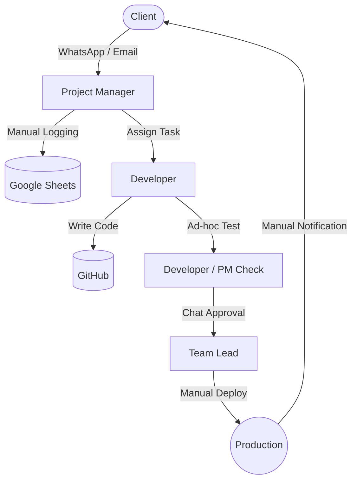

# Chapter 4 — Analysis

## 4.1 Introduction
The primary purpose of this chapter is to present a comprehensive analysis of the existing operational environment at Nextstepbd. Before designing a new system, it is essential to obtain a total understanding of the company's current practices, processes, capabilities, and challenges. To achieve this, a structured information-gathering strategy was formulated and executed. The findings from these activities allow for a robust assessment of business requirements and system constraints. Reviewing historical records, understanding operating procedures, and engaging stakeholders form the foundation for defining project scope and designing viable solutions.

## 4.2 Information Gathering 
Effective information gathering serves as the baseline for accurate system analysis. The analysis employed a multi-faceted approach to gather both qualitative and quantitative insights. This phase includes reviewing existing literature, standard operating procedures, and business forms, which lay the groundwork for subsequent on-site observations, interviews, and structured questionnaires to validate and expand upon the initial findings.

### 4.2.1 Review of Literature, Procedure and Forms
This preliminary phase involves examining documented evidence of how Nextstepbd operates. By analysing the company's publicly available literature, internal process guidelines, and the forms used to capture business data, we identify the baseline state of operations and highlight workflow gaps. Document analysis is frequently used during requirement elicitation to understand the current state before moving to the desired future state.

#### 4.2.1.1 Review of Literature 
A review of the company’s official website and public literature reveals that Nextstepbd operates with over a decade of service excellence, transitioning from a core software development team to a prominent provider of scalable, AI-powered enterprise solutions. Their external product portfolio features Voice AI Agents supporting multiple languages, Omnichannel Platforms for customer engagement, WhatsApp Marketing Managers, and HealthTech AI assistants. Beyond software products, they provide full-service enterprise development and creative content solutions to a vast global market. Their literature emphasizes attributes like rapid deployment, enterprise-grade security, broad digital reach, and seamless integration capabilities, successfully serving hundreds of industry-leading enterprise clients. However, contrasting this outward technical maturity with internal documents reveals a paradox: while their client-facing solutions are highly automated, their internal operations face scaling challenges and fragmentation due to rapid organizational growth.

#### 4.2.1.2 Review of Procedures
An examination of Nextstepbd's internal operating procedures highlights workflows that remain heavily dependent on manual coordination. Beyond core technical operations, business handling procedures also reflect informal processing:

- **Client Requirement Elicitation:** Initial client requirements and feature requests are predominantly gathered via informal channels such as WhatsApp or email threads. These requests are manually extrapolated into work items by Project Managers without formal sign-offs, frequently leading to scope ambiguity.
- **Development Process:** The development workflow begins with project managers manually assigning tasks to developers, with code generation and versioning handled via GitHub. However, the process suffers from limited internal documentation, informal peer review practices, and the absence of a standardized, automated development pipeline. 
- **Quality Assurance and Testing:** Testing is largely ad-hoc, mostly performed directly by developers or Project Managers instead of a dedicated QA workflow. Without systematic test plan coverage, code stability occasionally suffers before production deployment.
- **Deployment Process:** Once code is finalized, team leads manually review it before deployment. The deployment itself relies largely on manual execution and explicit verbal or chat-based approvals rather than an automated Continuous Integration/Continuous Deployment (CI/CD) pipeline. Finally, client notifications are communicated manually via WhatsApp or email. 
- **Billing and Invoicing:** Invoicing relies heavily on manual reconciliation. Project Managers compile completed features from disparate Google Sheets, and invoices are manually generated in Excel. Delivery of invoices and tracking of payments is handled through individual emails, creating delays and occasional discrepancies due to human error.
- **Customer Support & Incident Management:** Post-deployment bug reports and support requests bypass a formal ticketing system, routing directly to developers or managers via chat. Resolution tracking is unstructured, making it difficult to analyze historical defect rates or enforce performance SLAs.

The following diagrams illustrate the informal nature of the current core operations, highlighting the central bottlenecks and manual dependencies:

**Figure 4.1: Current Engineering & Delivery Workflow**

**Figure 4.2: Current Billing and Support Workflows**

While these procedures offer a high degree of situational flexibility, they create significant bottlenecks. The reliance on manual approvals, lack of automated workflows, and informal quality checks restrict operational scalability and introduce heavy dependencies on specific personnel.

#### 4.2.1.3 Review of Forms
Nextstepbd primarily utilizes unstructured spreadsheets (such as Google Sheets and Microsoft Excel) instead of dedicated, relational database forms for their internal record-keeping. Handling core entity data through static, multi-authored files heavily risks data integrity, creating vulnerabilities and duplications.

The table below summarizes the critical forms analyzed, their current medium, and the identified operational gaps:

| Form / Record Type | Purpose | Current Format | Limitations & Gaps |
| :--- | :--- | :--- | :--- |
| **Customer Records** | Capture client identification, contacts, and contract histories. | Disparate Excel / Google Sheets | No centralized repository; high data duplication; poor access control for sensitive data. |
| **Employee Setup & Skills** | Track developer profiles, competencies, and system access rights. | Flat Spreadsheets | Lacks integration with task assignments; difficult to query for capacity planning. |
| **Task Assignment Form** | Allocate project work, track deadlines, and monitor completion statuses. | WhatsApp messages / Google Sheets | Highly informal; lacks automated reminders, time-tracking, and dependency mapping. |
| **Performance Review** | Evaluate employee efficiency and track historical appraisal data. | Word Documents / Printed PDFs | Not systematically integrated with daily task execution records; stored in isolated drives. |
| **Billing & Invoice Form** | Bill clients for completed milestones or retainer periods. | Manual Excel Templates | Requires manual cross-referencing with task sheets; prone to calculation and tracking errors. |
| **Incident / Support Ticket** | Log bugs, system failures, and feature requests post-deployment. | Email threads & Chat Logs | No standardized intake form; difficult to track resolution times, SLAs, or defect trends. |

### 4.2.2 On Site Observation 
Due to scheduling constraints, the prevalence of remote and hybrid work models adopted by the team, and confidentiality requirements for ongoing projects, conducting a formal, prolonged on-site observation of the workflows was not possible for this study. Instead, the analysis relies more heavily on self-reported data through interviews and questionnaires, as well as the documentation analysis provided above.

### 4.2.3 Interview 
To gain a deeper, qualitative understanding of the operational challenges, semi-structured interviews were conducted with key stakeholders across Nextstepbd. These interviews helped identify unwritten rules, cultural pain points, and specific areas where the informal systems are failing to scale.

#### 4.2.3.1 Interview with CEO
**Q1: Can you describe the company's current strategic priorities for the next 12–24 months?**
**A:** Over the next year or two, our primary focus is strengthening recurring revenue streams while improving the predictability and quality of delivery. Practically, this means investing selectively in tools and process improvements that reduce rework and late deliveries, piloting automation to relieve project managers of repetitive reconciliation tasks, and packaging a small set of services into repeatable product offerings that generate steadier income. We are conscious of cost and time-to-value, so early pilots should deliver measurable operational benefits within a few months.

**Q2: What are the most important operational risks you see today?**
**A:** The most pressing risks are fragmented information flows that lead to misaligned scope and billing, single-person knowledge dependencies, and the use of informal channels for sensitive client data. Fragmented records create disputes that take time to resolve and harm client trust; key-person dependencies create single points of failure when staff leave or are unavailable; and informal handling of PII or credentials raises legal and reputational exposure. Mitigations should therefore focus on reliable capture of approvals, shared knowledge practices, and stronger access controls.

**Q3: How do you measure service delivery success and client satisfaction?**
**A:** We track a mix of operational and customer-facing indicators: on-time delivery rates, a basic client satisfaction check after each engagement, the volume and severity of billing disputes, and the time PMs spend on reconciliation activities. Qualitative feedback from account leads also informs our assessment, especially where repeated clarifications or churn indicate deeper process issues. Over time I’d like these measures to be automated or surfaced on dashboards so we can act faster.

**Q4: Which processes or tools do you think limit the company's ability to scale?**
**A:** Reliance on spreadsheets and chat for approvals and record-keeping is a major limiter. Without canonical identifiers for clients and contracts and a reliable capture mechanism for approvals, we add headcount to preserve consistency rather than improving efficiency. Likewise, tools that require duplicate entry or do not integrate well force manual reconciliation work that does not scale.

**Q5: How are decisions about investment in tools, integrations, and people made?**
**A:** Decisions are made by weighing ROI against time-to-value and risk. For urgent pain points we prefer low-friction SaaS pilots to prove value quickly; for structural capabilities or compliance needs we consider funded internal or custom work. Larger expenditures typically require a sponsor-level approval and a clear business case showing cost savings or revenue protection.

**Q6: How do you currently obtain evidence for client approvals, scope changes, or billing disputes?**
**A:** Evidence today is ad hoc: threaded chats, e-mails, occasional screenshots and entries in shared Sheets are stitched together when needed. This reactive process is time-consuming and unreliable, making it hard to resolve disputes quickly or to provide audit-grade records. A structured capture mechanism that attaches minimal metadata (who, when, what) to approvals would significantly reduce resolution time.

**Q7: What is your view on balancing quick fixes (SaaS) versus developing custom systems?**
**A:** I favour starting with SaaS where it buys speed, lowers upfront cost, and reduces immediate pain. If a SaaS pilot proves the business case and data ownership or auditability is a concern, we can invest in custom systems for long-term control. The decision depends on the pilot results, costs, and how much control we need over data lifecycle and provenance.

**Q8: How do you prioritise competing requests from clients, delivery, and operations?**
**A:** We prioritise by client impact and revenue risk first, then by recurring operational cost (tasks that repeatedly consume staff time), and finally by ease and speed of implementation. This approach protects cashflow and targets reductions in predictable overhead; however, we also keep a small buffer for strategic bets or compliance work.

**Q9: Can you describe any recent incidents where fragmented communication or data issues caused a material problem?**
**A:** One recent example involved a short WhatsApp message from a client that was interpreted as approval, but because it wasn't linked to the tracked requirement the PM and developer implemented a different set of expectations. The result was a scope mismatch, a delayed invoice and a time-consuming reconciliation involving three teams. That incident highlighted how informal approvals cause downstream rework and client friction.

**Q10: What outcomes would make a project like this successful from your perspective?**
**A:** Success would include a measurable reduction in reconciliation and dispute resolution time, consistent capture of approvals linked to work items during pilots, demonstrable freed-up PM capacity, and positive qualitative feedback from staff and at least one client who participated in the pilot. I’d also want clear, objective dashboards showing capture rates, error rates, and operator queue health to make a confident go/no-go decision.

#### 4.2.3.2 Interview with HR
**Q1: Describe the current onboarding process for new hires. What typically takes the longest?**
**A:** We welcome new hires with standard orientation documents and pair them with a mentor who provides practical guidance in the first weeks. The longest items are arranging access across multiple tools and transferring nuanced project context, including client preferences and informal norms; as a result it typically takes two to four weeks for a new hire to feel productive. Mentors invest significant time answering ad hoc questions and clarifying undocumented practices, which slows overall onboarding throughput.

**Q2: How are role responsibilities and handoffs documented and enforced?**
**A:** Formal job descriptions exist, but daily handoffs are often captured in managers' notes, meeting updates or informal documents rather than a single authoritative system. Enforcement is chiefly manager-driven and varies by team, which can create inconsistencies and misunderstandings during transitions. A lightweight centralised handoff record and a simple checklist would improve continuity.

**Q3: How is staff workload and capacity tracked today?**
**A:** Workload is tracked in spreadsheets and through manager estimates during planning meetings; there is no single live capacity dashboard. Because of that, capacity issues can remain hidden until they cause delays and require reactive reallocation. Implementing a simple capacity view would allow more proactive balancing and reduce last-minute bottlenecks.

**Q4: Are there recurring staffing or skills gaps that affect delivery?**
**A:** Yes — we often see gaps in specialist skills and slower ramping for junior staff due to inconsistent onboarding depth and the lack of a maintained skills inventory. When demand spikes we rely on temporary reassignments, which disrupts planned work. A basic skills registry and periodic upskilling sessions would mitigate this.

**Q5: What HR policies govern access to client data and communications?**
**A:** We rely on contractual confidentiality clauses and standard account permissions provided by each tool. We lack company-wide automated controls over chat history and shared documents, which increases exposure risk for sensitive information. Strengthening role-based access and retention policies would reduce this vulnerability.

**Q6: How do you collect feedback from staff about tools and processes?**
**A:** Feedback is collected via occasional surveys and through line managers during one-on-ones. Response rates and follow-through can be inconsistent, which makes it hard to prioritise and act on feedback. A continuous lightweight feedback channel with tracked follow-up would improve responsiveness.

**Q7: What training or knowledge-transfer activities exist to reduce single-person dependencies?**
**A:** We rely on buddy systems and ad-hoc recorded sessions for knowledge sharing, but we do not currently run a formal curriculum or scheduled cross-training. Consequently, important knowledge can remain concentrated in a few individuals. Introducing structured documentation sprints and a rotation schedule would help spread expertise.

**Q8: How would improved process automation change HR workload or training needs?**
**A:** Automation could remove routine administrative tasks such as account provisioning and recurring compliance checks, freeing HR and mentors to focus on coaching and development. However, we would need to invest in initial training and change-management activities to ensure that staff adopt new tools and understand updated workflows.

**Q9: How is employee performance measured relative to process adherence?**
**A:** Performance assessments focus mainly on delivery KPIs and manager evaluations; process adherence is observed informally rather than being quantitatively tracked. This means that consistently following process is not always directly rewarded. Introducing a small set of measurable process indicators could help align behaviour with desired practices.

**Q10: What concerns would you have about introducing new tools that change daily workflows?**
**A:** Key concerns are adoption friction, a temporary spike in support requests, and the potential for privacy or access-control lapses if tools are not configured correctly. Clear rollout plans, short training sessions, and role-based access rules would help mitigate these issues.

#### 4.2.3.3 Interview with Engineering Manager 
**Q1: How is the current development and deployment workflow organised?**
**A:** Our current workflow uses feature branches in GitHub with CI/CD orchestrated through GitHub Actions, separate staging and production environments, and manual gates for significant releases. Developers open PRs and request reviews, and releases include a brief verification step by QA or the PM to ensure migrations and release notes are correct. This balance works for our team size but relies on human checks for some safety-critical steps.

**Q2: What are the main pain points in integrating third-party tools (Sheets, WhatsApp, GitHub)?**
**A:** Primary pain points include inconsistent or missing identifiers in Sheets, schema drift, WhatsApp template and rate constraints, and uneven webhook support from certain providers. These issues make connectors brittle and require ongoing data cleaning and exception handling. Building resilient connectors requires investment in retries, deduplication logic and operator workflows to handle edge cases.

**Q3: How do you manage schema or API changes for external services?**
**A:** We cope with changes via informal contract tests, close cross-team coordination and occasional emergency fixes. There is no formal schema registry or automated change detection, so breaking changes sometimes surface in production. A lightweight contract-testing framework and versioned connector interfaces would reduce these incidents.

**Q4: Describe the current approach to logging, monitoring and incident response.**
**A:** We aggregate application logs, but monitoring is fragmented and alerting is configured in several places. Incident response is coordinated over chat and handled ad hoc; this is manageable for smaller incidents but scales poorly for complex outages that span multiple systems. Clear runbooks, centralised alerting and post-incident reviews would improve resilience.

**Q5: What testing strategies are in place for integration points (unit, integration, contract tests)?**
**A:** Unit testing is mature, but integration and contract tests are less consistent and typically created per-connector as needed. For higher-confidence integrations we add mock endpoints and reconciliation test cases, but a standardised pipeline for integration testing would increase reliability.

**Q6: How do you prioritise engineering work against operational support tasks?**
**A:** Production incidents and urgent support tickets take precedence; planned integration work is scheduled into sprints based on business value and available capacity. We try to reserve a portion of velocity for technical debt and platform improvements to avoid long-term accumulation of operational fragility.

**Q7: What infrastructure or platform constraints (hosting, secret management) should we consider?**
**A:** We have limited staging environments, secrets are managed in a simple vault or via environment variables, and budget constraints affect our choice between managed and self-hosted services. These constraints inform decisions about how much to invest in ephemeral testing infrastructure or managed middleware.

**Q8: How would you evaluate an integration platform (self-hosted vs managed)?**
**A:** A managed platform is attractive if it reduces maintenance, provides robust retry/observability, and offers SLA-backed support; however, it must also allow data export and provenance controls. If a managed service cannot meet data control or redaction requirements, a self-hosted solution may be warranted despite higher operational cost.

**Q9: What are typical SLAs you can support for synchronization and reconciliation jobs?**
**A:** For pilots we can support hourly bulk synchronisations reliably. Near-real-time syncing is feasible for small volumes but requires careful monitoring and rate-limit handling. Tight SLAs for high-volume real-time processing would require additional investment in infrastructure and observability.

**Q10: What data privacy and redaction controls are feasible within current tooling?**
**A:** We can implement redaction at ingestion and enforce role-based access in the canonical store; however, some third-party platforms may restrict how redaction can be applied downstream. The recommended approach is to perform redaction before persisting to external systems and to maintain detailed audit logs for access.

#### 4.2.3.4 Interview with Employees
**Q1: Describe a typical day and the tools you use most frequently.**
**A:** A typical day involves frequent context switching between WhatsApp/Slack for quick messages, Google Sheets for trackers, GitHub for code and issue management, and our task tracker for assignments. Much of the day is spent clarifying small points, updating trackers and responding to client or internal queries, which creates cognitive load and frequent interruptions. These transitions make it difficult to maintain deep focus and increase the time required to complete higher-value tasks.

**Q2: How do you capture decisions, approvals and changes to scope?**
**A:** Most decisions and approvals are captured informally in chat; only when a dispute or billing need is anticipated do we add formal notes to Sheets or ticket comments. This reactive capture process often results in incomplete records that are hard to audit later. A lightweight confirmation workflow that attaches metadata to an approval would improve traceability.

**Q3: Which tasks require repeated manual work or copy-paste between tools?**
**A:** Repetitive tasks include copying client messages into Sheets, updating statuses in multiple systems, and reconciling billing notes. These manual steps take time and are prone to mistakes, diverting effort from client communication and quality assurance.

**Q4: What problems do you face when tracking task ownership or deadlines?**
**A:** Ownership gets blurred when several people contribute to a thread, and fragmented context leads to missed deadlines because not everyone shares the same understanding of the task. Having a single authoritative owner field linked to the approval or task would reduce confusion and improve accountability.

**Q5: How often do you need to ask colleagues to clarify prior messages or decisions?**
**A:** I typically need to ask for clarifications multiple times per week, especially when approvals were informal or lacked key details. These clarifications interrupt workflows and can compound delays as items pile up.

**Q6: What would make your daily work noticeably easier?**
**A:** A one-click confirmation flow that links approvals to the related task, clearer templates for client requests, and fewer overlapping tools would make daily work noticeably easier and reduce rework. Even small structured messages that capture essential metadata would save time.

**Q7: Are there tools or features you currently avoid because they are too slow or unreliable?**
**A:** We avoid heavy CRMs and any tools requiring duplicate entry or manual syncing. Tools that add friction to quick conversational workflows rarely get adopted, even if they offer better structure.

**Q8: Do you keep copies of client messages or important approvals outside of work tools? Why?**
**A:** Yes—sometimes I take screenshots or keep local notes because the main tools don't always preserve context in a retrievable way. This helps in dispute scenarios but introduces security and organisational consistency issues.

**Q9: How comfortable are you with small automation that reduces repetitive tasks?**
**A:** I'm open to small automations that reduce repetitive work, provided they preserve key context and offer an easy manual override for exceptions. Suggested automations that surface recommended updates rather than auto-applying them would be most acceptable.

**Q10: What would you want to see in training or documentation for new workflows?**
**A:** Short, practical how-to guides, quick video demos for common tasks and in-app tips are most effective. Long manuals are rarely read; bite-sized guidance works best for adoption.

#### 4.2.3.5 Interview with Customers
**Q1: How do you prefer to communicate with our team (chat, email, calls)?**
**A:** I prefer WhatsApp or chat for quick clarifications and short questions, and e-mail for formal confirmations or anything that might affect invoicing or scope. For more complex discussions I am open to scheduled calls, but agreeing up front on a single channel for confirmations reduces ambiguity and speeds decisions.

**Q2: Do you feel confident that your approvals and confirmations are recorded accurately?**
**A:** Not always. While I assume the provider captures approvals, the lack of an explicit confirmation mechanism creates uncertainty; I'd feel more confident with a clear, single-step confirmation tied to the task or change.

**Q3: Have you experienced delays or repeated questions from the team due to unclear instructions?**
**A:** Occasionally — follow-up questions arise when instructions are incomplete or when staff interpret context differently. These small delays add up and can be avoided with clearer templates or a short confirmation workflow.

**Q4: How important is it for you that approvals are traceable for billing or contract reasons?**
**A:** Very important. Traceable approvals are essential for billing clarity and for resolving disputes efficiently. When approvals are time-stamped and linked to a task, reconciliation is straightforward.

**Q5: What is the simplest way we could make communication easier for you?**
**A:** A short confirmation message or an in-app button that records the approval would make it much easier and reduce the need for follow-ups. If that confirmation were also included in the invoice or a weekly summary, it would streamline billing conversations.

**Q6: Would you be comfortable using a brief in-app confirmation workflow if it saves time?**
**A:** Yes — I would use a quick in-app confirmation if it's low-friction and doesn't add extra steps to my normal routine. Anything that reduces follow-ups and speeds resolution is welcome.

**Q7: How much documentation would you expect attached to an approval (e.g., scope note, screenshots)?**
**A:** For minor approvals a short scope note suffices; for larger changes I expect a brief description of impact on timeline and cost, plus any relevant screenshots. Keeping documentation concise but sufficient is important.

**Q8: Have you ever disputed an invoice due to unclear approvals? What happened?**
**A:** Yes—once a billing dispute arose because a scope change was implemented without a clear, linked approval. It required sharing chat logs and emails to resolve and took several days. A recorded approval would have resolved it quicker.

**Q9: How do you prefer to receive project summaries or release notes?**
**A:** I prefer short weekly summaries via email with links to any supporting messages or tickets. Highlighting decisions and open actions at the top makes it easier to scan.

**Q10: What would make you more confident in the company's record-keeping around approvals?**
**A:** Automatic linking of approvals to the relevant ticket, a visible audit trail showing who approved and when, and easy export options for records would increase confidence. Simple access controls and clear retention policies would also help.

### 4.2.4 Questionnaires
To supplement the qualitative interviews with broader metric-focused trends, structured questionnaires were distributed to various groups within and outside the company.

#### 4.2.4.1 Data Collection Strategy
The strategy involved sending targeted online surveys via Google Forms to distinct stakeholder groups: Executive Leadership, HR/Operations, Engineering Management, Staff Developers, and a subset of active Clients. The forms consisted primarily of Likert-scale questions, multiple-choice options, and short-form text fields to ensure high completion rates and to generate measurable data for the subsequent system design phases.

#### 4.2.4.2 Questionnaire with CEO
1. The company has clear, consistently-applied processes for capturing client approvals.
2. Current tools give leadership a reliable view of project status.
3. Operational errors (billing, scope drift) are primarily caused by process gaps rather than resourcing.
4. The company can afford short-term SaaS subscriptions to solve urgent problems.
5. Data provenance and auditability are high priorities for the company.
6. Improvements in integrations would significantly reduce operational overhead.
7. I am willing to allocate budget to a validated pilot that reduces manual reconciliation.
8. Leadership has enough visibility into project risk and bottlenecks to intervene early.
9. The company can support a small pilot without disrupting core delivery commitments.
10. Standardising approvals and data capture is worth the effort even if it changes informal habits.

#### 4.2.4.3 Questionnaire with HR
1. New hires reach baseline productivity within two months.
2. Role responsibilities are clearly documented and accessible.
3. We have reliable data on individual and team capacity.
4. There is sufficient internal training to support new tools.
5. Skills and competencies are regularly updated in a central place.
6. HR receives frequent requests to clarify task ownership.
7. Automation would free enough staff time to justify its cost.
8. Access to client communications is managed appropriately for privacy.
9. We have an effective mentor program for junior staff.
10. Staff are generally open to small process changes that reduce repetitive work.
11. We have a documented cross-training plan for critical roles.
12. Staff can easily find up-to-date onboarding and process documents.
13. HR receives enough feedback to improve workflows before problems become serious.

#### 4.2.4.4 Questionnaire with Employees 
1. I can find the latest version of a client instruction without asking a colleague.
2. I often spend time reconciling information between tools.
3. Approvals given in chat are usually sufficient for me to proceed.
4. I regularly need to redact or remove sensitive client information before saving it.
5. Automated assignment would reduce my time on routine tasks.
6. I have clear guidance on which channel to use for formal approvals.
7. I am confident that the tools we use maintain accurate records for billing.
8. I sometimes save client messages locally for my reference.
9. I would use a one-click confirmation flow if it were available.
10. I receive too many notifications from tools.
11. I can access historical project notes easily.
12. I know who to contact when a data inconsistency is found.
13. I feel the current workflows support timely delivery.
14. I have adequate time for impromptu clarifications that arise during a project.
15. I am willing to try small workflow changes if they reduce manual work.

#### 4.2.4.5 Questionnaire with Customers
1. I am satisfied with the clarity of communication from Nextstepbd.
2. I can easily confirm scope changes when requested.
3. I have experienced billing issues caused by miscommunication.
4. I would prefer a formal confirmation button for approvals rather than informal messages.
5. I find it easy to retrieve past messages or confirmations when needed.
6. Response times to my queries are acceptable.
7. I trust the company to handle my data appropriately.
8. I would be willing to use a brief in-app confirmation step if it saves clarification time.
9. I have needed the company to produce evidence of approval for billing or audit purposes.
10. Overall, I am satisfied with project delivery.

#### 4.2.4.6 Questionnaire with Engineering Manager 
1. Our engineering team can support a small integration pilot within existing capacity.
2. We have sufficient testing environments for integration validation.
3. The current logging and monitoring practices are adequate for production use.
4. We can implement redaction and access controls without major platform changes.
5. Managed iPaaS solutions would reduce engineering effort compared to building connectors in-house.
6. We have clear procedures for rolling back migrations or syncs.
7. Integration work is easier when canonical IDs are available across systems.
8. Rate limits on external APIs are a significant constraint for planned integrations.
9. We have an established process for maintaining connector code and tests.
10. Observability tools are available to track end-to-end integration health.
11. Our team can add secure redaction and audit logging without major architectural changes.
12. We have a reliable process for validating external schema or API changes before release.
13. Managed connectors or iPaaS tools would reduce long-term maintenance risk for integrations.

#### 4.2.4.7 Questionnaires Rubrics and Scoring Guidance
To interpret the structured responses objectively without disclosing sensitive aggregate data prematurely, the following scoring rubrics and aggregate thresholds were defined.

**General Likert Interpretation (Per-Item)**
- **1 (Strongly disagree / Never):** Clear problem or strong negative signal.
- **2 (Disagree / Rarely):** Concerning; likely needs targeted action.
- **3 (Neutral / Sometimes):** Mixed; investigate with follow-ups or qualitative interviews.
- **4 (Agree / Often):** Positive signal; may still have isolated issues.
- **5 (Strongly agree / Always):** Strong positive signal; generally healthy in this area.

**Suggested Aggregate Thresholds (Per Questionnaire)**
- **Average <= 2.5 (High Priority):** Plan immediate remedial actions and detailed follow-up interviews.
- **Average > 2.5 and < 3.5 (Medium Priority):** Investigate specific low-scoring items and validate with interviews.
- **Average >= 3.5 (Low Priority):** Maintain and monitor; consider pilot for incremental improvement.
