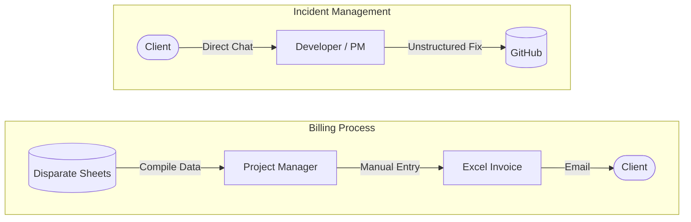

# Chapter 4 — Analysis

## 4.1 Introduction
The primary purpose of this chapter is to present a comprehensive analysis of the existing operational environment at Nextstepbd. Before designing a new system, it is essential to obtain a total understanding of the company's current practices, processes, capabilities, and challenges. To achieve this, a structured information-gathering strategy was formulated and executed. The findings from these activities allow for a robust assessment of business requirements and system constraints. Reviewing historical records, understanding operating procedures, and engaging stakeholders form the foundation for defining project scope and designing viable solutions.

## 4.2 Information Gathering 
Effective information gathering serves as the baseline for accurate system analysis. The analysis employed a multi-faceted approach to gather both qualitative and quantitative insights. This phase includes reviewing existing literature, standard operating procedures, and business forms, which lay the groundwork for subsequent on-site observations, interviews, and structured questionnaires to validate and expand upon the initial findings.

### 4.2.1 Review of Literature, Procedure and Forms
This preliminary phase involves examining documented evidence of how Nextstepbd operates. By analysing the company's publicly available literature, internal process guidelines, and the forms used to capture business data, we identify the baseline state of operations and highlight workflow gaps. Document analysis is frequently used during requirement elicitation to understand the current state before moving to the desired future state.

#### 4.2.1.1 Review of Literature 
A review of the company’s official website and public literature reveals that Nextstepbd operates with over a decade of service excellence, transitioning from a core software development team to a prominent provider of scalable, AI-powered enterprise solutions. Their external product portfolio features Voice AI Agents supporting multiple languages, Omnichannel Platforms for customer engagement, WhatsApp Marketing Managers, and HealthTech AI assistants. Beyond software products, they provide full-service enterprise development and creative content solutions to a vast global market. Their literature emphasizes attributes like rapid deployment, enterprise-grade security, broad digital reach, and seamless integration capabilities, successfully serving hundreds of industry-leading enterprise clients. However, contrasting this outward technical maturity with internal documents reveals a paradox: while their client-facing solutions are highly automated, their internal operations face scaling challenges and fragmentation due to rapid organizational growth.

#### 4.2.1.2 Review of Procedures
An examination of Nextstepbd's internal operating procedures highlights workflows that remain heavily dependent on manual coordination. Beyond core technical operations, business handling procedures also reflect informal processing:

- **Client Requirement Elicitation:** Initial client requirements and feature requests are predominantly gathered via informal channels such as WhatsApp or email threads. These requests are manually extrapolated into work items by Project Managers without formal sign-offs, frequently leading to scope ambiguity.
- **Development Process:** The development workflow begins with project managers manually assigning tasks to developers, with code generation and versioning handled via GitHub. However, the process suffers from limited internal documentation, informal peer review practices, and the absence of a standardized, automated development pipeline. 
- **Quality Assurance and Testing:** Testing is largely ad-hoc, mostly performed directly by developers or Project Managers instead of a dedicated QA workflow. Without systematic test plan coverage, code stability occasionally suffers before production deployment.
- **Deployment Process:** Once code is finalized, team leads manually review it before deployment. The deployment itself relies largely on manual execution and explicit verbal or chat-based approvals rather than an automated Continuous Integration/Continuous Deployment (CI/CD) pipeline. Finally, client notifications are communicated manually via WhatsApp or email. 
- **Billing and Invoicing:** Invoicing relies heavily on manual reconciliation. Project Managers compile completed features from disparate Google Sheets, and invoices are manually generated in Excel. Delivery of invoices and tracking of payments is handled through individual emails, creating delays and occasional discrepancies due to human error.
- **Customer Support & Incident Management:** Post-deployment bug reports and support requests bypass a formal ticketing system, routing directly to developers or managers via chat. Resolution tracking is unstructured, making it difficult to analyze historical defect rates or enforce performance SLAs.

The following diagrams illustrate the informal nature of the current core operations, highlighting the central bottlenecks and manual dependencies:

**Figure 4.1: Current Engineering & Delivery Workflow**

**Figure 4.2: Current Billing and Support Workflows**

While these procedures offer a high degree of situational flexibility, they create significant bottlenecks. The reliance on manual approvals, lack of automated workflows, and informal quality checks restrict operational scalability and introduce heavy dependencies on specific personnel.

#### 4.2.1.3 Review of Forms
Nextstepbd primarily utilizes unstructured spreadsheets (such as Google Sheets and Microsoft Excel) instead of dedicated, relational database forms for their internal record-keeping. Handling core entity data through static, multi-authored files heavily risks data integrity, creating vulnerabilities and duplications.

The table below summarizes the critical forms analyzed, their current medium, and the identified operational gaps:

| Form / Record Type | Purpose | Current Format | Limitations & Gaps |
| :--- | :--- | :--- | :--- |
| **Customer Records** | Capture client identification, contacts, and contract histories. | Disparate Excel / Google Sheets | No centralized repository; high data duplication; poor access control for sensitive data. |
| **Employee Setup & Skills** | Track developer profiles, competencies, and system access rights. | Flat Spreadsheets | Lacks integration with task assignments; difficult to query for capacity planning. |
| **Task Assignment Form** | Allocate project work, track deadlines, and monitor completion statuses. | WhatsApp messages / Google Sheets | Highly informal; lacks automated reminders, time-tracking, and dependency mapping. |
| **Performance Review** | Evaluate employee efficiency and track historical appraisal data. | Word Documents / Printed PDFs | Not systematically integrated with daily task execution records; stored in isolated drives. |
| **Billing & Invoice Form** | Bill clients for completed milestones or retainer periods. | Manual Excel Templates | Requires manual cross-referencing with task sheets; prone to calculation and tracking errors. |
| **Incident / Support Ticket** | Log bugs, system failures, and feature requests post-deployment. | Email threads & Chat Logs | No standardized intake form; difficult to track resolution times, SLAs, or defect trends. |
