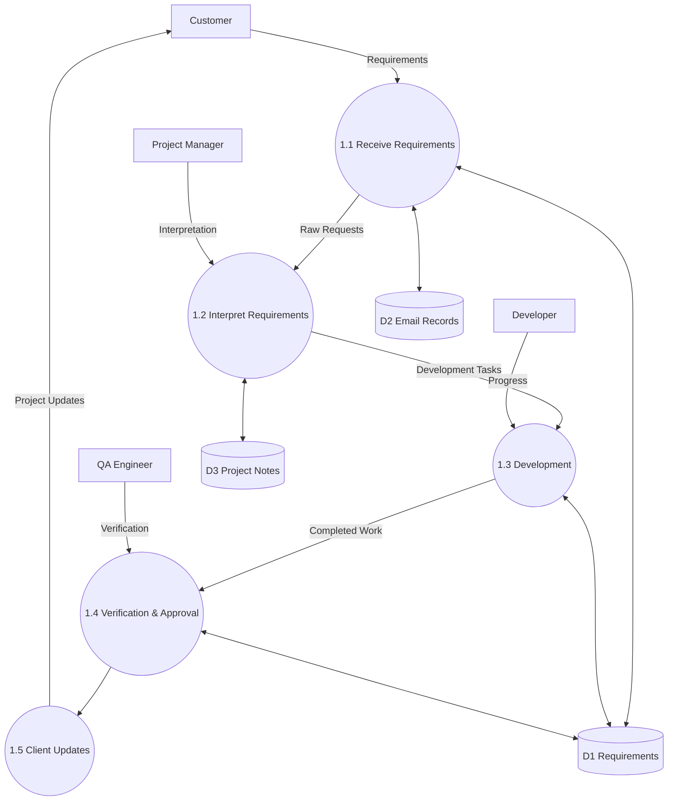
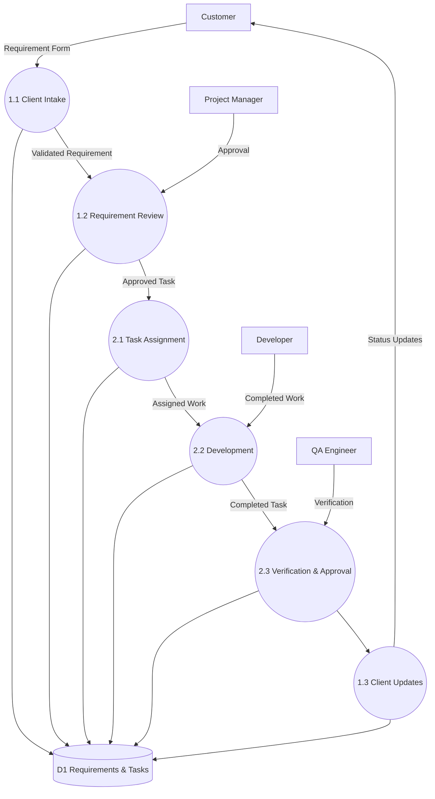
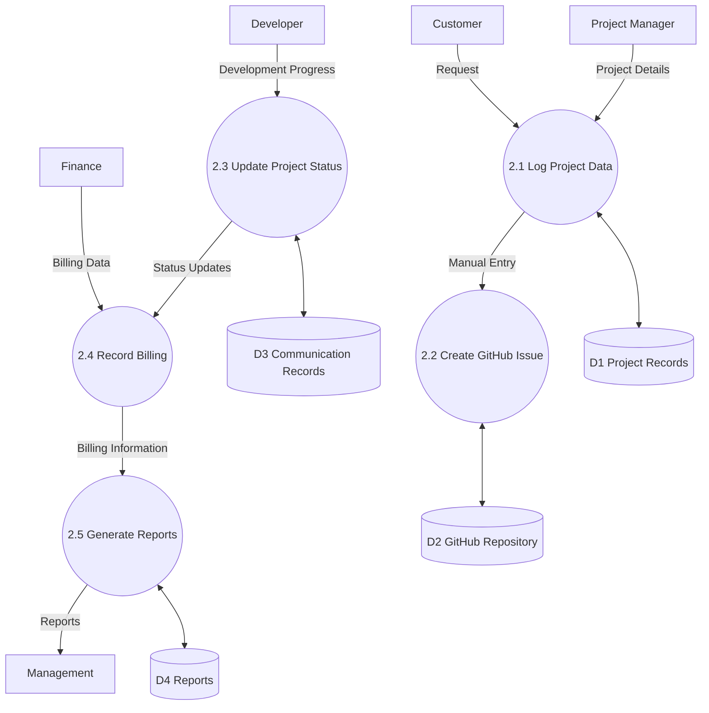
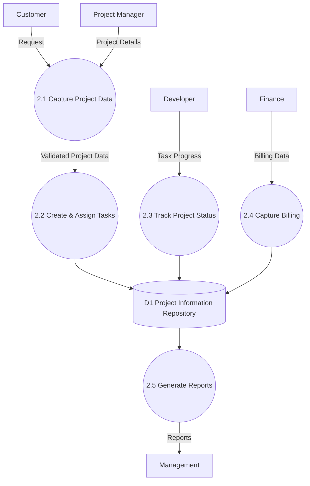
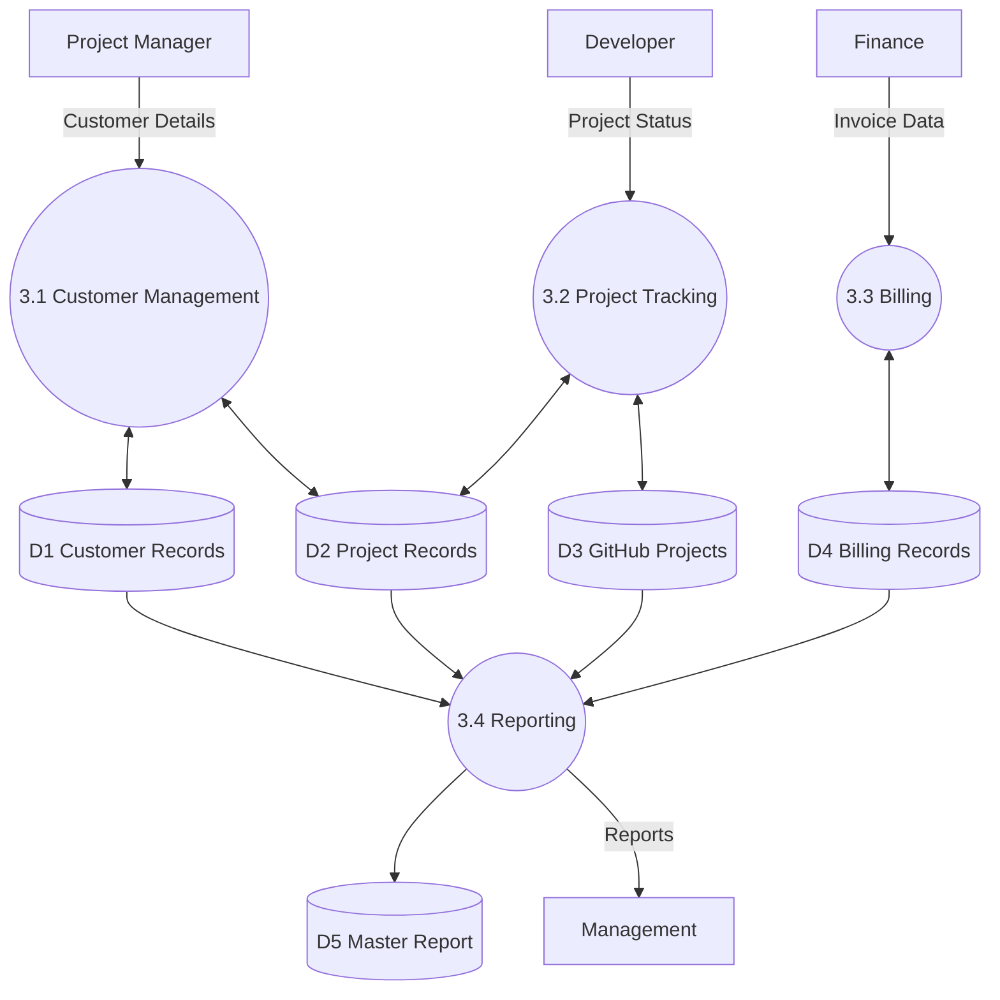
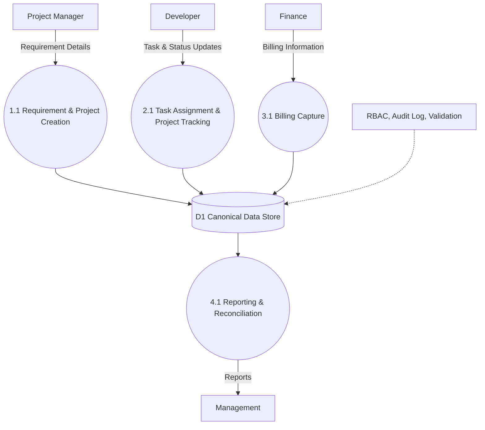
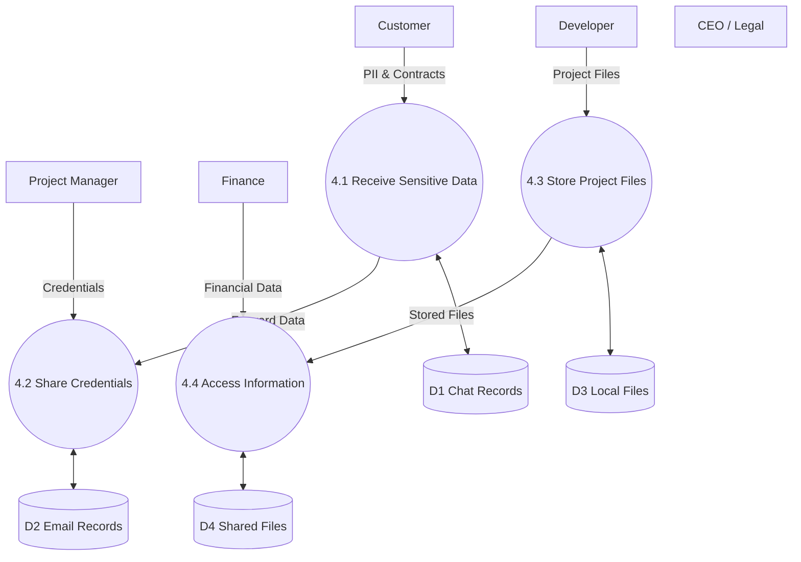
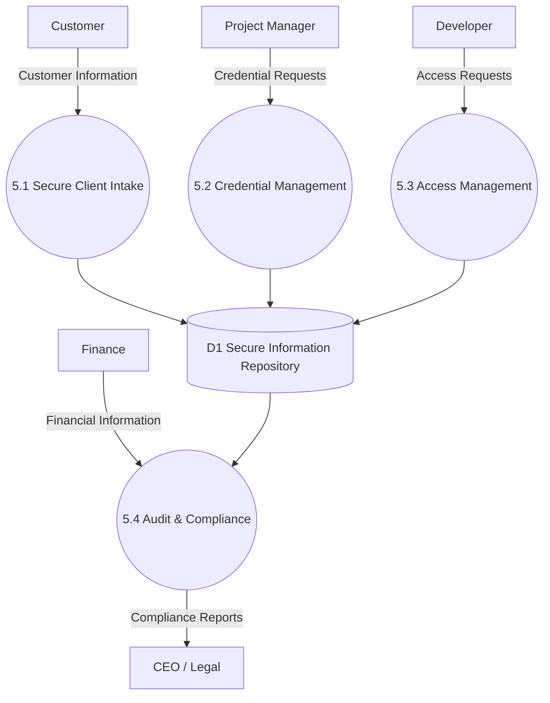
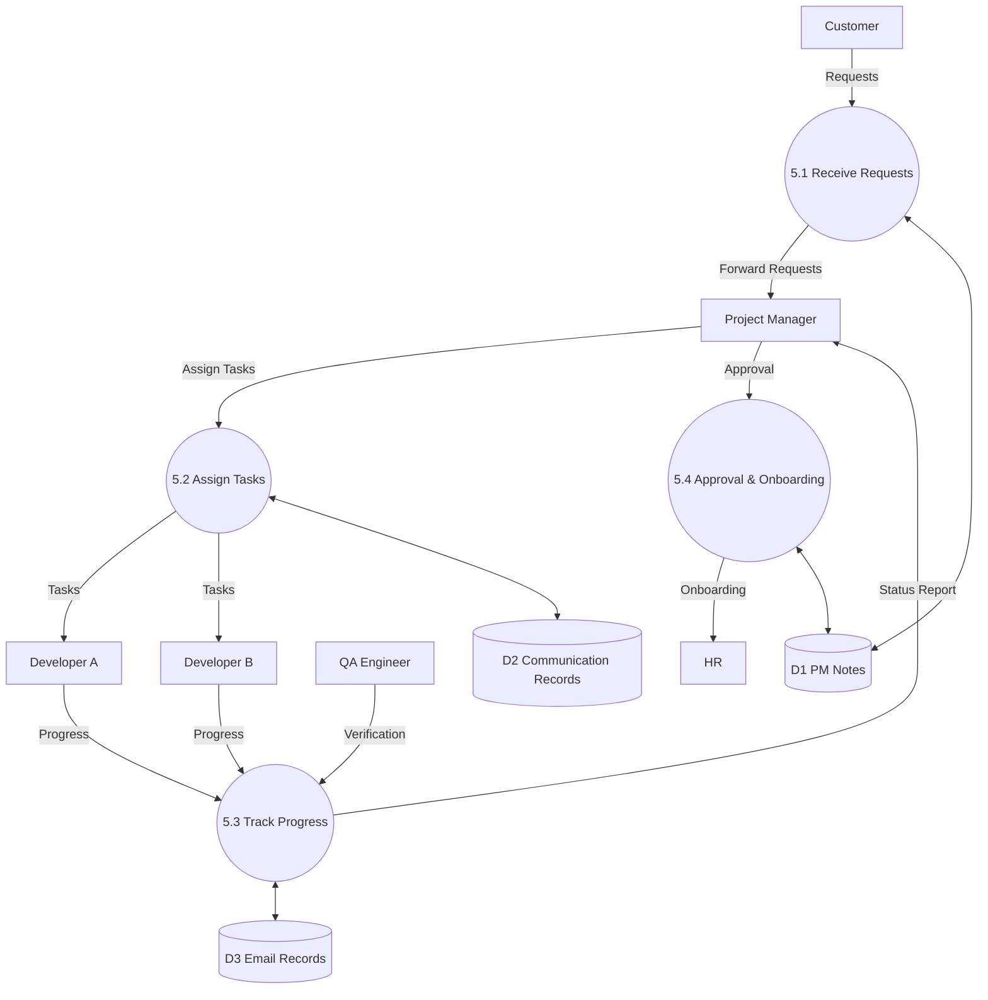
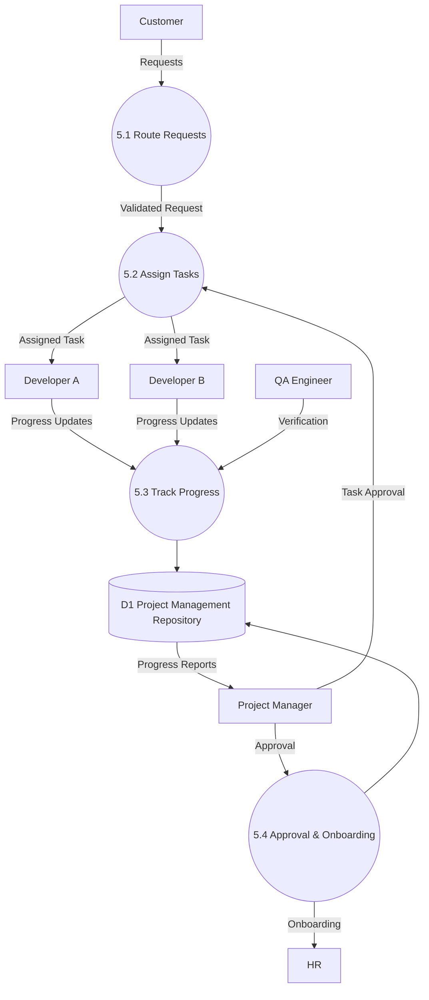

# NextStepBD ISAD Report — Mermaid Diagram Source (Selected Figures)

This file contains the Mermaid source for the **14 node/edge diagrams** in
`report.tex` that are being replaced with rendered image files.

> **For each figure, do the following:**
> 1. Render the Mermaid block to PNG (e.g. via mermaid-cli, mermaid.live, or any
>    Mermaid renderer that supports `flowchart`, `graph`, and `erDiagram`).
> 2. Save the PNG to `images/<FILENAME>` (listed below each block).
> 3. Crop / tidy as needed — the original TikZ positions are intentionally
>    loose and may have whitespace that can be trimmed.
>
> After the images are in place, recompile `report.tex` — no other changes to
> the report are required.

## Filename scheme

`images/fig-{N}-{M}.png`

* `N` = chapter number
* `M` = figure number within the chapter (i.e. the rendered figure number is
  `N.M`)

So figure **4.17** → `images/fig-4-17.png`, figure **5.6** →
`images/fig-5-6.png`, etc.

## Figures included (14 total)

| Figure | Caption | File |
|---|---|---|
| 4.1 | Current Engineering & Delivery Workflow | `images/fig-4-1.png` |
| 4.2 | Current Billing and Support Workflows | `images/fig-4-2.png` |
| 4.17 | Level 1 DFD — Problem 1: Fragmented Communication & Collaboration | `images/fig-4-17.png` |
| 4.18 | Level 1 DFD — Problem 2: System Fragmentation & Lack of Integration | `images/fig-4-18.png` |
| 4.19 | Level 1 DFD — Problem 3: Data Management & Governance Deficiencies | `images/fig-4-19.png` |
| 4.20 | Level 1 DFD — Problem 4: Security & Access Control Risks | `images/fig-4-20.png` |
| 4.21 | Level 1 DFD — Problem 5: Scalability & Operational Bottlenecks | `images/fig-4-21.png` |
| 4.22 | Comparative Feasibility Framework — Three Alternative Solution Strategies | `images/fig-4-22.png` |
| 5.2 | Level 1 DFD — Problem 1: Fragmented Communication & Collaboration | `images/fig-5-2.png` |
| 5.3 | Level 1 DFD — Problem 2: System Fragmentation & Lack of Integration | `images/fig-5-3.png` |
| 5.4 | Level 1 DFD — Problem 3: Data Management & Governance Deficiencies | `images/fig-5-4.png` |
| 5.5 | Level 1 DFD — Problem 4: Security & Access Control Risks | `images/fig-5-5.png` |
| 5.6 | Level 1 DFD — Problem 5: Scalability & Operational Bottlenecks | `images/fig-5-6.png` |
| 5.7 | ER Diagram — Canonical Data Model | `images/fig-5-7.png` |

## Rendering notes

* All diagrams are **Mermaid `flowchart` or `graph`** (left-to-right) unless
  marked otherwise.
* The ER diagram (Figure 5.6) uses Mermaid `erDiagram` syntax.
* Edge labels (`|"…"|>`) carry the original TikZ arrow labels.
* Subgraphs (`subgraph … end`) are used to reproduce group boxes (e.g.
  "Messaging", "Records", "Engineering" lanes).
* Shape syntax used:
  * `id["text"]` — rectangle (process / store / tool)
  * `id(("text"))` — circle (process bubbles, central node, problem badges)
  * `id[("text")]` — cylindrical (data stores in DFDs)
* Direction is `LR` (left-to-right) for DFDs and most workflow diagrams,
  and `TD` (top-down) for layered / framework diagrams.

---

# p1_old_system_dfd:

# p1_new_system_dfd:

# p2_old_system_dfd:

# p2_new_system_dfd:

# p3_old_system_dfd:

# p3_new_system_dfd:

# p4_old_system_dfd:

# p4_new_system_dfd:

# p5_old_system_dfd:

# p5_new_system_dfd:

