# NextStepBD ISAD Report — Mermaid Diagram Source (Selected Figures)

This file contains the Mermaid source for the **14 node/edge diagrams** in
`report.tex` that are being replaced with rendered image files.

> **For each figure, do the following:**
> 1. Render the Mermaid block to PNG (e.g. via mermaid-cli, mermaid.live, or any
>    Mermaid renderer that supports `flowchart`, `graph`, and `erDiagram`).
> 2. Save the PNG to `images/<FILENAME>` (listed below each block).
> 3. Crop / tidy as needed — the original TikZ positions are intentionally
>    loose and may have whitespace that can be trimmed.
>
> After the images are in place, recompile `report.tex` — no other changes to
> the report are required.

## Filename scheme

`images/fig-{N}-{M}.png`

* `N` = chapter number
* `M` = figure number within the chapter (i.e. the rendered figure number is
  `N.M`)

So figure **4.17** → `images/fig-4-17.png`, figure **5.6** →
`images/fig-5-6.png`, etc.

## Figures included (14 total)

| Figure | Caption | File |
|---|---|---|
| 4.1 | Current Engineering & Delivery Workflow | `images/fig-4-1.png` |
| 4.2 | Current Billing and Support Workflows | `images/fig-4-2.png` |
| 4.17 | Level 1 DFD — Problem 1: Fragmented Communication & Collaboration | `images/fig-4-17.png` |
| 4.18 | Level 1 DFD — Problem 2: System Fragmentation & Lack of Integration | `images/fig-4-18.png` |
| 4.19 | Level 1 DFD — Problem 3: Data Management & Governance Deficiencies | `images/fig-4-19.png` |
| 4.20 | Level 1 DFD — Problem 4: Security & Access Control Risks | `images/fig-4-20.png` |
| 4.21 | Level 1 DFD — Problem 5: Scalability & Operational Bottlenecks | `images/fig-4-21.png` |
| 4.22 | Comparative Feasibility Framework — Three Alternative Solution Strategies | `images/fig-4-22.png` |
| 5.1 | Complete System DFD — the recommended new system on top of the existing context diagram | `images/fig-5-1.png` |
| 5.2 | Problem-Solving System DFD — side-by-side comparison (existing vs. new) | `images/fig-5-2.png` |
| 5.3 | Integration Core Subsystem DFD | `images/fig-5-3.png` |
| 5.4 | Configured Collaboration & Workflow Subsystem DFD | `images/fig-5-4.png` |
| 5.5 | DevOps, QA, and Observability Subsystem DFD | `images/fig-5-5.png` |
| 5.6 | ER Diagram — Canonical Data Model | `images/fig-5-6.png` |

## Rendering notes

* All diagrams are **Mermaid `flowchart` or `graph`** (left-to-right) unless
  marked otherwise.
* The ER diagram (Figure 5.6) uses Mermaid `erDiagram` syntax.
* Edge labels (`|"…"|>`) carry the original TikZ arrow labels.
* Subgraphs (`subgraph … end`) are used to reproduce group boxes (e.g.
  "Messaging", "Records", "Engineering" lanes).
* Shape syntax used:
  * `id["text"]` — rectangle (process / store / tool)
  * `id(("text"))` — circle (process bubbles, central node, problem badges)
  * `id[("text")]` — cylindrical (data stores in DFDs)
* Direction is `LR` (left-to-right) for DFDs and most workflow diagrams,
  and `TD` (top-down) for layered / framework diagrams.

---

## Figure 4.1 — Current Engineering & Delivery Workflow

**Filename:** `images/fig-4-1.png`

**Source location in `report.tex`:** lines 1978–2010 (pre-splice)
**LaTeX label:** (none)

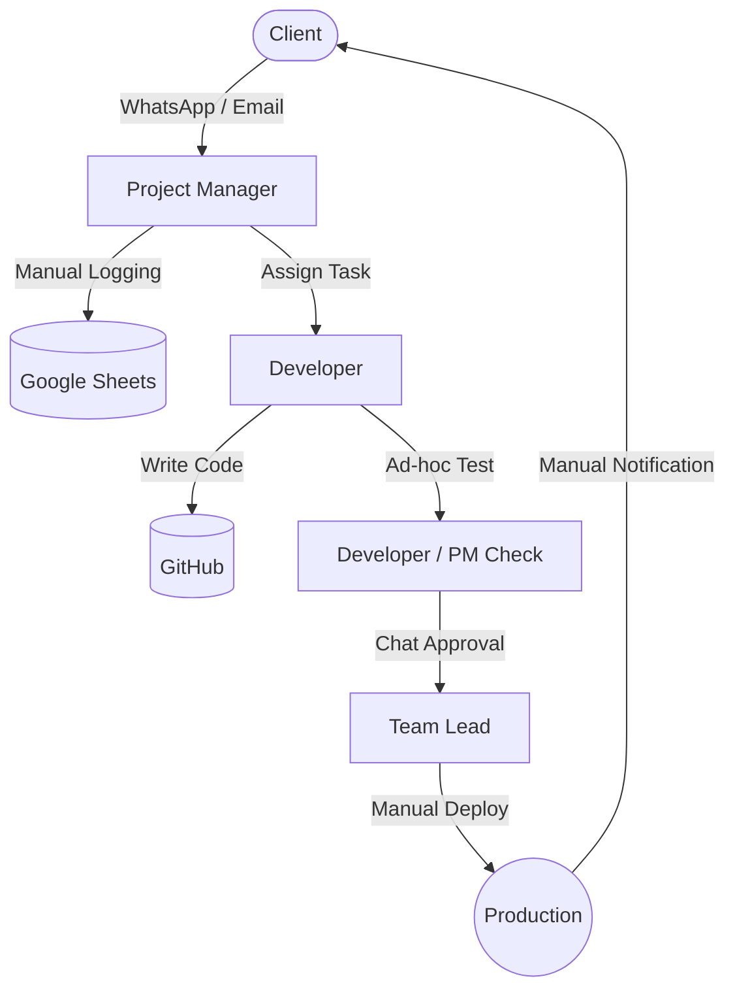

---

## Figure 4.2 — Current Billing and Support Workflows

**Filename:** `images/fig-4-2.png`

**Source location in `report.tex`:** lines 2012–2049 (pre-splice)
**LaTeX label:** (none)

**Note:** Two subgraphs (Billing Process, Incident Management) with their
own actors / processes / stores.

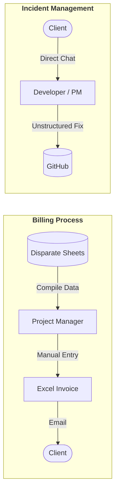

---

## Figure 4.17 — Level 1 DFD: Problem 1 (Fragmented Communication & Collaboration)

**Filename:** `images/fig-4-17.png`

**Source location in `report.tex`:** lines 2988–3038 (pre-splice)
**LaTeX label:** `fig:dfd_prob1`

**Note:** Three informal-channel stores D1, D2, D3 are shared bidirectionally
between processes. Rendered as cylindrical data-store shapes.

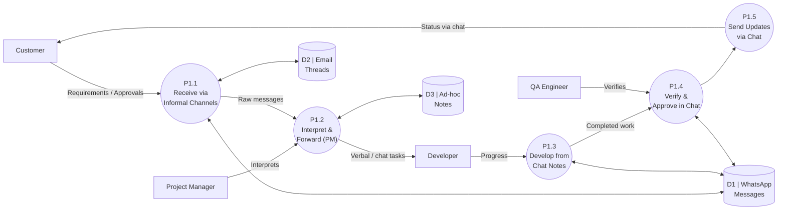

---

## Figure 4.18 — Level 1 DFD: Problem 2 (System Fragmentation & Lack of Integration)

**Filename:** `images/fig-4-18.png`

**Source location in `report.tex`:** lines 3051–3103 (pre-splice)
**LaTeX label:** `fig:dfd_prob2`

**Note:** Five disconnected data stores (D4–D8). The fragmentation is
implicit in the layout — none of D4–D8 share arrows with each other.

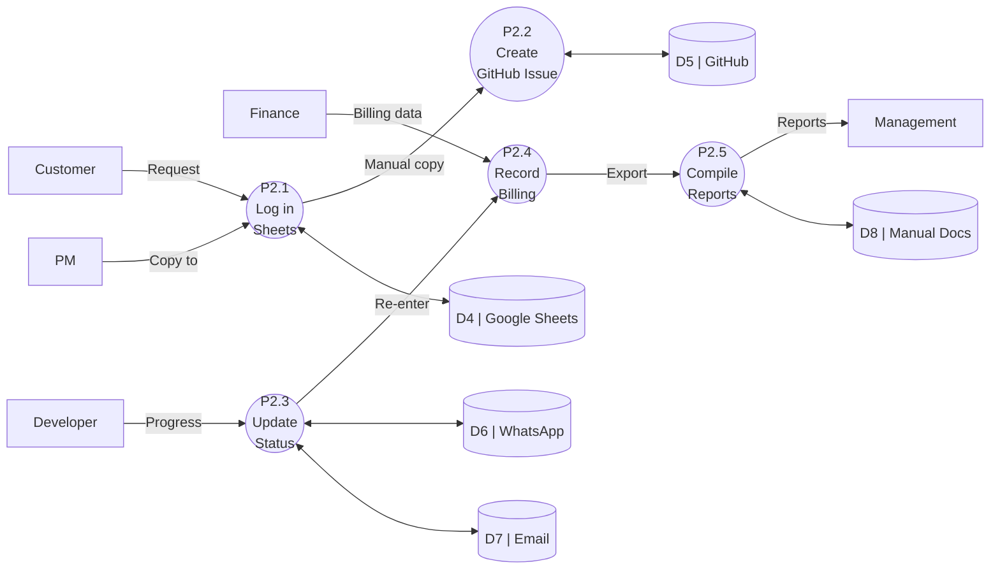

---

## Figure 4.19 — Level 1 DFD: Problem 3 (Data Management & Governance Deficiencies)

**Filename:** `images/fig-4-19.png`

**Source location in `report.tex`:** lines 3116–3166 (pre-splice)
**LaTeX label:** `fig:dfd_prob3`

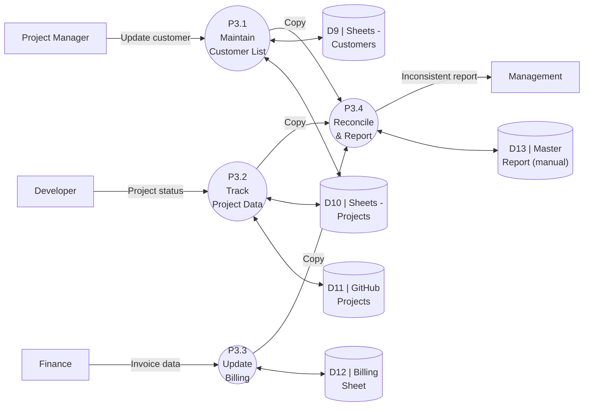

---

## Figure 4.20 — Level 1 DFD: Problem 4 (Security & Access Control Risks)

**Filename:** `images/fig-4-20.png`

**Source location in `report.tex`:** lines 3179–3226 (pre-splice)
**LaTeX label:** `fig:dfd_prob4`

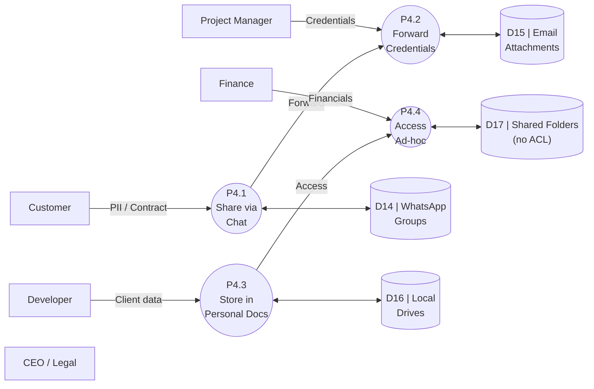

---

## Figure 4.21 — Level 1 DFD: Problem 5 (Scalability & Operational Bottlenecks)

**Filename:** `images/fig-4-21.png`

**Source location in `report.tex`:** lines 3239–3291 (pre-splice)
**LaTeX label:** `fig:dfd_prob5`

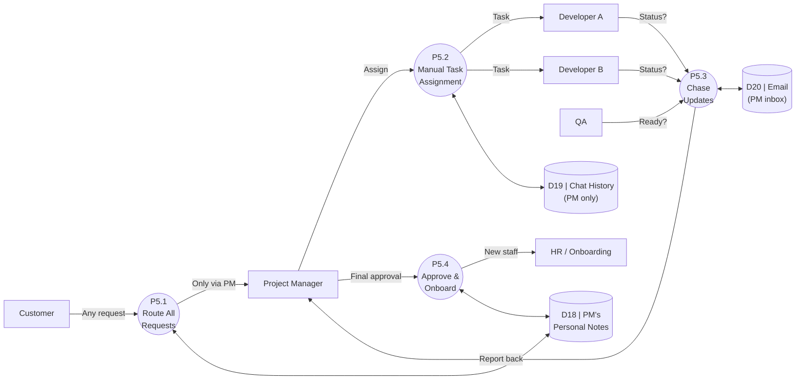

---

## Figure 4.22 — Comparative Feasibility Framework

**Filename:** `images/fig-4-22.png`

**Source location in `report.tex`:** lines 3343–3406 (pre-splice)
**LaTeX label:** `fig:feasibility-framework`

**Note:** Five problems across the top, three strategy boxes in the
middle, three feasibility lenses below, decision node, and design
handoff at the bottom. Edges from each problem fan out to each of the
three strategies (Mermaid will render these as 15 thin arrows; the
visual clutter is acceptable because the message is "all five problems
feed all three strategies").

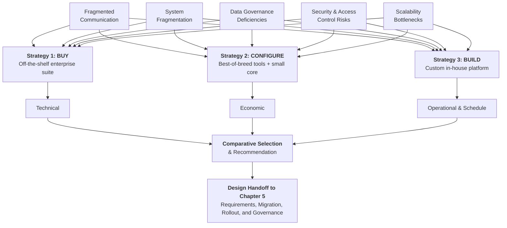

---

## Figure 5.1 — Complete System DFD (new system on top of existing context diagram)

**Filename:** `images/fig-5-1.png`

**Source location in `report.tex`:** lines 4200–4309 (pre-splice)
**LaTeX label:** `fig:dfd-complete-system`

**Note:** External entities (E1–E4) match the Ch4 context diagram
positions. The undifferentiated process P0 is replaced by three new
processes (P-new-collab, P-new-core, P-new-devops) and one canonical
store (D-canonical). Legacy stores D1–D13 and legacy process P0 are
shown faded on the right. Cross-cutting controls wrap the new
architecture.

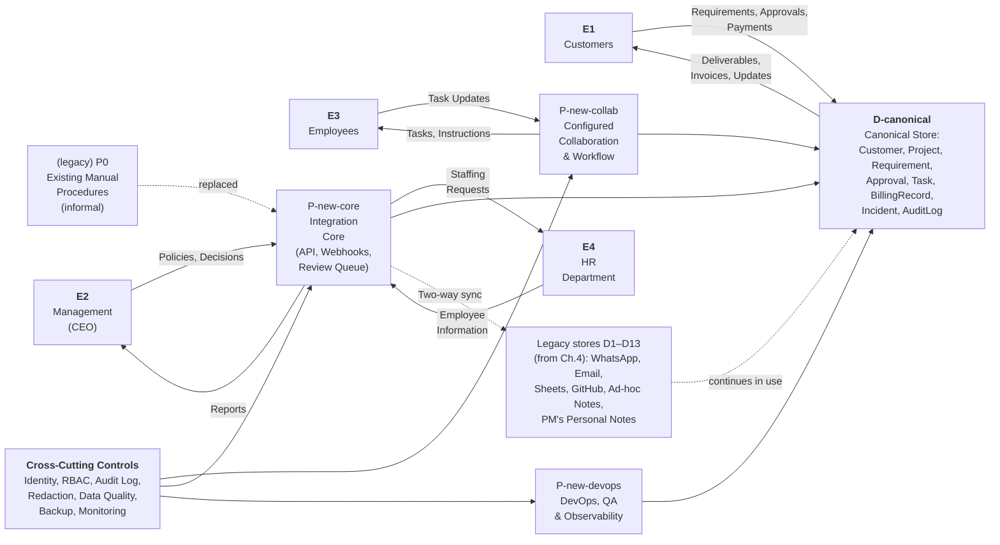

---

## Figure 5.2 — Problem-Solving System DFD (side-by-side: existing vs. new)

**Filename:** `images/fig-5-2.png`

**Source location in `report.tex`:** lines 4347–4463 (pre-splice)
**LaTeX label:** `fig:dfd-problem-solving`

**Note:** Left half is the existing system (Ch.4 context diagram
mirrored). Right half is the new system (P-new-collab / P-new-core /
P-new-devops with the canonical store and the P4 cross-cutting halo).
Problem badges (P1–P5) are shown as small circle nodes near the new
flows they address. A dashed migration arrow connects "P0 (existing)"
to the new system.

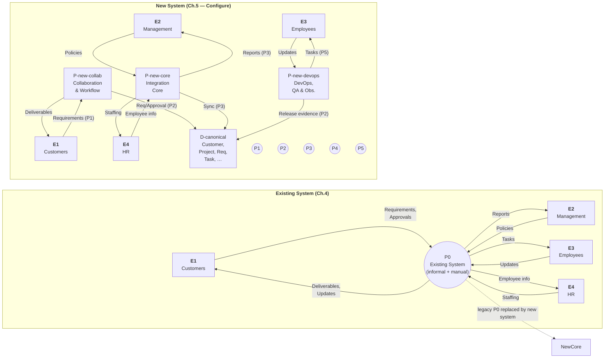

---

## Figure 5.3 — Integration Core Subsystem DFD

**Filename:** `images/fig-5-3.png`

**Source location in `report.tex`:** lines 4584–4648 (pre-splice)
**LaTeX label:** `fig:dfd-integration-core`

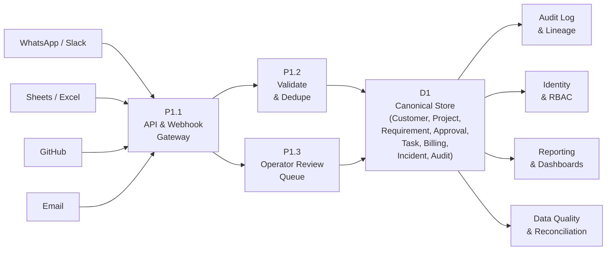

---

## Figure 5.4 — Configured Collaboration & Workflow Subsystem DFD

**Filename:** `images/fig-5-4.png`

**Source location in `report.tex`:** lines 4691–4752 (pre-splice)
**LaTeX label:** `fig:dfd-collaboration`

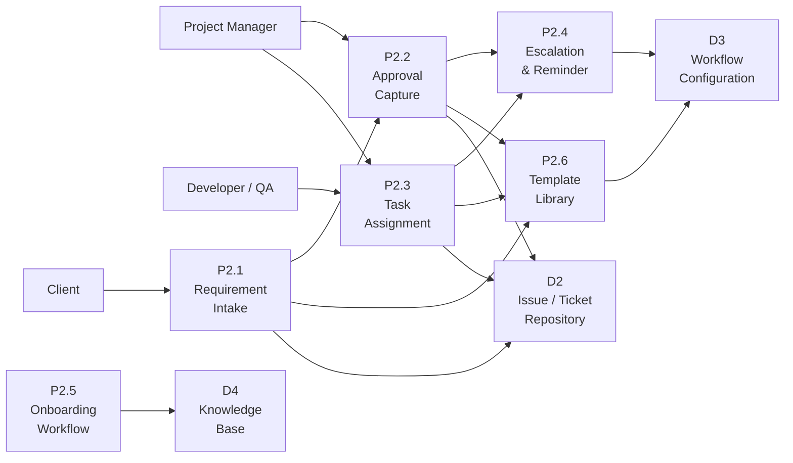

---

## Figure 5.5 — DevOps, QA, and Observability Subsystem DFD

**Filename:** `images/fig-5-5.png`

**Source location in `report.tex`:** lines 4813–4879 (pre-splice)
**LaTeX label:** `fig:dfd-devops`

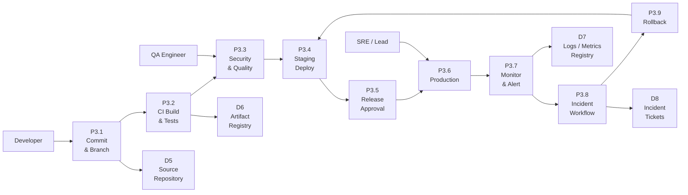

---

## Figure 5.6 — ER Diagram (Canonical Data Model)

**Filename:** `images/fig-5-6.png`

**Source location in `report.tex`:** lines 4989–5043 (pre-splice)
**LaTeX label:** `fig:er-diagram`

**Note:** Uses Mermaid `erDiagram` syntax (the only diagram in the
report that does). Cardinalities follow the original TikZ labels:
"1" for single, "1..N" for one-to-many, "0..N" for optional many.

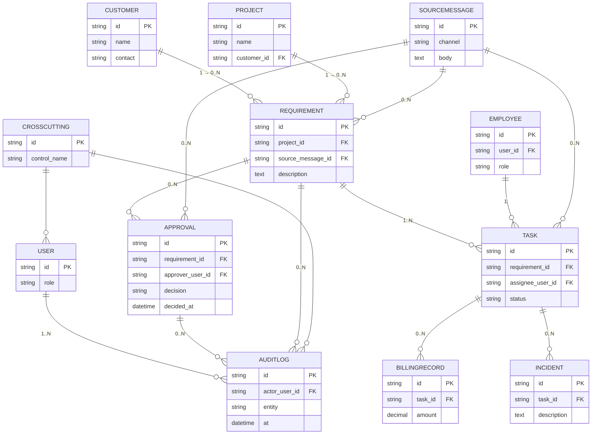

---

# End of diagrams

When all 14 PNGs are placed under `images/`, recompile `report.tex` (the
LaTeX file is already updated to reference these filenames via
`\includegraphics{images/<FILENAME>}`).
